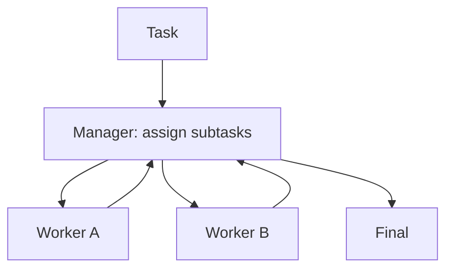

# Manager-Worker (Orchestrator-Workers)

## What Problem It Solves

When tasks require multiple specialties, a single agent struggles.  
Manager-Worker introduces:

- a manager to decompose/assign
- workers to execute subtasks
- a manager synthesis step

## Core Flow

## Evolution Path

- Comes from: routing + specialization
- Often combined with: **agents-as-tools**, **group chat**, **handoff**

## Repo Reference

- Code: `src/agent_patterns_lab/patterns/manager_worker.py`
- Example: `examples/60_manager_worker.py`
- Tests: `tests/test_manager_worker.py`

