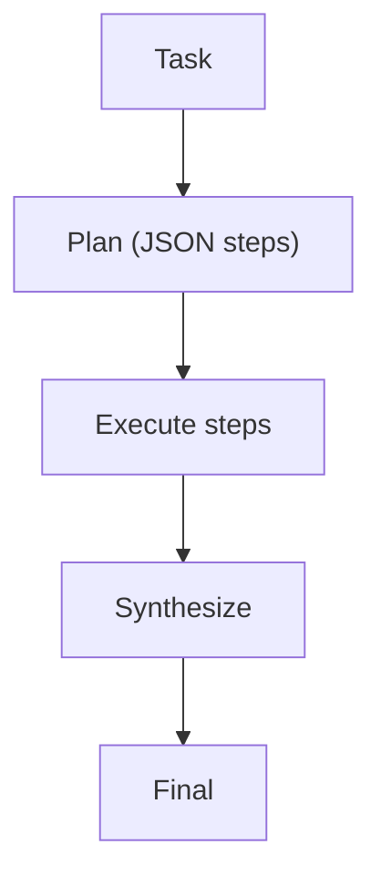

# Plan & Solve

## What Problem It Solves

For long-horizon tasks, directly “answer now” often fails. Plan & Solve splits:

1. generate a plan (structured)
2. execute steps
3. synthesize final answer

## Core Flow

## Evolution Path

- Comes from: workflow chaining (but steps are model-chosen)
- Leads to: **PER** (replanning when needed), **LLM Compiler** (DAG execution)

## Repo Reference

- Code: `src/agent_patterns_lab/patterns/plan_and_solve.py`
- Example: `examples/50_plan_and_solve.py`
- Tests: `tests/test_plan_and_solve.py`

