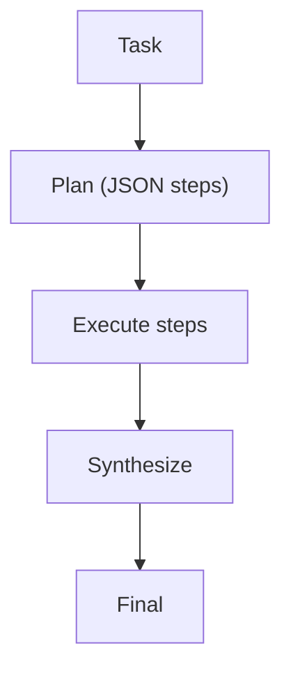

# Plan & Solve

## What Problem It Solves

For long-horizon tasks, directly “answer now” often fails. Plan & Solve splits:

1. generate a plan (structured)
2. execute steps
3. synthesize final answer

## When to Use

- The task has multiple steps and you want an explicit plan artifact.
- You need debuggability (intermediate outputs) more than raw latency.
- You can define what “done” looks like per step.

## When NOT to Use

- The task is truly one-step (classify, rewrite, short answer) → a plan is overhead.
- The environment is highly interactive (you must react to tool outputs each step) → use PER or ReAct.
- You can’t define step-level success criteria → planning won’t help; you’ll just get pretty checklists.

## Core Flow



## How It Works

Plan & Solve introduces an explicit “planning artifact”:

1. **Plan**: the model outputs a step list (ideally structured) with clear success criteria.
2. **Execute**: run steps in order, collecting intermediate results.
3. **Synthesize**: compose the final answer from verified step outputs.

This helps because planning forces the model to externalize structure and reduces “lost in the middle” reasoning.

### Mechanics (what to make explicit)

- **Plan schema**: steps should have `id`, `goal`, `inputs`, `definition_of_done`.
- **Execution driver**: don’t let the model “half follow” the plan; execute step-by-step and log results.
- **Plan review**: add a cheap checker that catches missing prerequisites or impossible steps before execution.
- **Budgeting**: cap plan length and step retries; long plans are a cost trap.

## Worked Example

```bash
UV_CACHE_DIR=.uv_cache PYTHONPATH=src uv run --no-sync python examples/50_plan_and_solve.py
```

## Failure Modes & Mitigations

- **Bad plan** (missing steps, wrong order): add a plan review step; enforce a plan template.
- **Plan not followed**: make execution read the plan step-by-step; log deviations.
- **Reality mismatch** (tool outputs change assumptions): add replanning (PER) or a replanner role.
- **Over-planning**: cap plan length; merge trivial steps.

## Evolution Path

- Comes from: workflow chaining (but steps are model-chosen)
- Leads to: **PER** (replanning when needed), **LLM Compiler** (DAG execution)

## Repo Reference

- Code: [`src/agent_patterns_lab/patterns/plan_and_solve.py`](https://github.com/lifeodyssey/agent-patterns-lab/blob/main/src/agent_patterns_lab/patterns/plan_and_solve.py)
- Example: [`examples/50_plan_and_solve.py`](https://github.com/lifeodyssey/agent-patterns-lab/blob/main/examples/50_plan_and_solve.py)
- Tests: [`tests/test_plan_and_solve.py`](https://github.com/lifeodyssey/agent-patterns-lab/blob/main/tests/test_plan_and_solve.py)

## References

- Wang et al. (2023). *Plan-and-Solve Prompting*: https://arxiv.org/abs/2305.04091
