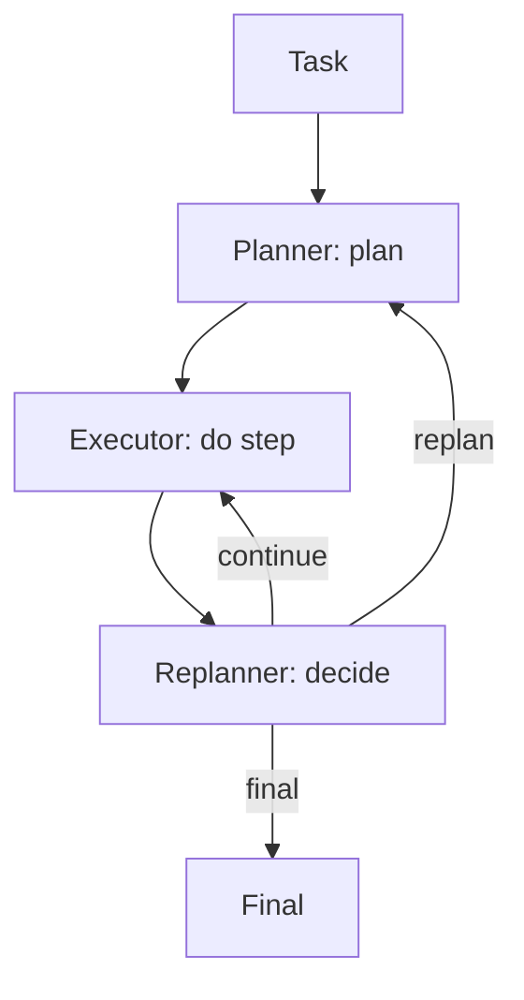

# Planner-Executor-Replanner (PER)

## TL;DR (One Sentence)

PER makes planning **explicit and revisable**: plan → execute → decide whether to continue, replan, or finish.

## You Probably Need This When (Symptoms)

- You start with a plan, then tool results make it wrong.
- Your agent “thrashes” (keeps changing direction) because replanning is implicit and uncontrolled.
- You can define concrete replan triggers (contradiction, missing prerequisite, budget risk).

## What Problem It Solves

Plans can become wrong mid-run. PER introduces a replanner that decides:

- continue
- replan
- finish (final)

## When to Use

- The world can change during execution (tool outputs can invalidate the plan).
- You want an explicit replan decision instead of “ad-hoc thrashing”.
- You can define triggers for replanning (contradictions, new evidence, failures).

## When NOT to Use

- The plan is stable and rarely invalidated → Plan & Solve (or a workflow) is simpler.
- You can’t define what counts as “plan invalid” → you’ll replan based on vibes and burn budget.
- Your main issue is tool interaction step-by-step → start with ReAct (then add PER if needed).

## Core Flow



## Walkthrough (One Replan Moment)

You can read PER as “a normal plan” plus one extra decision point:

1. **Planner** produces a plan (e.g., steps `[A, B, C]`).
2. **Executor** runs step `A` and records observations.
3. **Replanner** checks triggers:
   - if observations contradict the plan → **replan**
   - if progress is fine → **continue**
   - if the goal is reached → **final**

The key is not “better planning”. It’s that **replanning becomes explicit, testable, and budgeted**.

## How It Works

PER makes “planning” a living process:

- **Planner** produces an initial plan artifact.
- **Executor** follows the plan step-by-step and records observations.
- **Replanner** periodically checks whether the plan is still valid and decides to:
  - continue with the next step,
  - generate a new plan given updated state, or
  - finish and synthesize a final result.

This separation reduces thrashing: execution stays focused while replanning stays explicit and auditable.

### Mechanics (what makes replanning sane)

- **Replan triggers**: encode concrete triggers (tool failure, contradiction, missing prerequisite, budget risk).
- **Plan delta**: don’t rewrite everything every time; allow “edit plan” operations (insert/replace/remove steps).
- **State snapshot**: replanner should see a compact state (ledger + key observations), not the entire raw transcript.
- **Replan budget**: cap replans; too many replans is a symptom (bad tools, bad plan schema, missing retrieval).

## Worked Example

```bash
UV_CACHE_DIR=.uv_cache PYTHONPATH=src uv run --no-sync python examples/51_planner_executor_replanner.py
```

??? example "Example code (`examples/51_planner_executor_replanner.py`)"
    ```python
    --8<-- "examples/51_planner_executor_replanner.py"
    ```

## Failure Modes & Mitigations

- **Replan too often**: add thresholds (only replan on contradictions or major new evidence).
- **Never replan**: force periodic checks; add “is plan still valid?” rubric.
- **Role confusion**: keep prompts/IO schemas distinct per role.
- **State loss**: store step results and decisions in a trace/ledger.

## Evolution Path

- Extends: **Plan & Solve** with explicit “plan may change”
- Often combined with: **Retrieval** (new evidence triggers replans)

## Repo Reference

- Code: [`src/agent_patterns_lab/patterns/planner_executor_replanner.py`](https://github.com/lifeodyssey/agent-patterns-lab/blob/main/src/agent_patterns_lab/patterns/planner_executor_replanner.py)
- Example: [`examples/51_planner_executor_replanner.py`](https://github.com/lifeodyssey/agent-patterns-lab/blob/main/examples/51_planner_executor_replanner.py)
- Tests: [`tests/test_per.py`](https://github.com/lifeodyssey/agent-patterns-lab/blob/main/tests/test_per.py)

## References

- Plan-and-Solve Prompting (planning artifact inspiration): https://arxiv.org/abs/2305.04091
- ReAct (closed-loop control with observations): https://arxiv.org/abs/2210.03629
