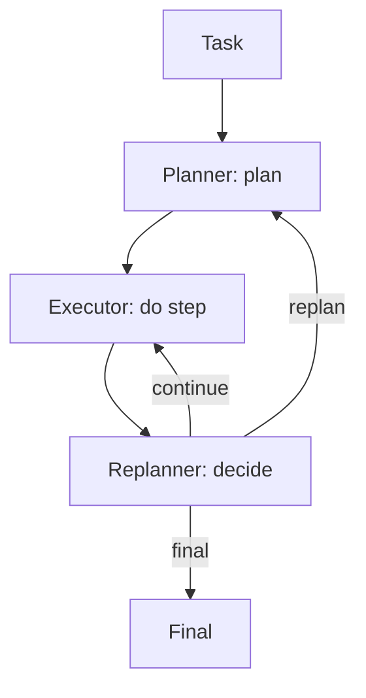

# Planner-Executor-Replanner (PER)

## What Problem It Solves

Plans can become wrong mid-run. PER introduces a replanner that decides:

- continue
- replan
- finish (final)

## Core Flow

## Evolution Path

- Extends: **Plan & Solve** with explicit “plan may change”
- Often combined with: **Retrieval** (new evidence triggers replans)

## Repo Reference

- Code: `src/agent_patterns_lab/patterns/planner_executor_replanner.py`
- Example: `examples/51_planner_executor_replanner.py`
- Tests: `tests/test_per.py`

