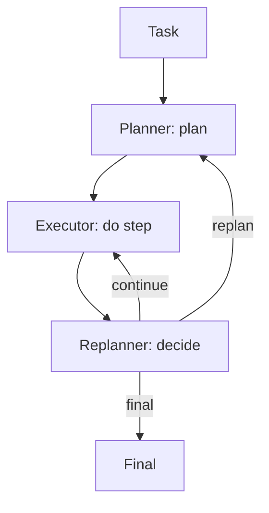

# Planner-Executor-Replanner (PER)

## What Problem It Solves

Plans can become wrong mid-run. PER introduces a replanner that decides:

- continue
- replan
- finish (final)

## Core Flow

## How It Works

PER makes “planning” a living process:

- **Planner** produces an initial plan artifact.
- **Executor** follows the plan step-by-step and records observations.
- **Replanner** periodically checks whether the plan is still valid and decides to:
  - continue with the next step,
  - generate a new plan given updated state, or
  - finish and synthesize a final result.

This separation reduces thrashing: execution stays focused while replanning stays explicit and auditable.

## Failure Modes & Mitigations

- **Replan too often**: add thresholds (only replan on contradictions or major new evidence).
- **Never replan**: force periodic checks; add “is plan still valid?” rubric.
- **Role confusion**: keep prompts/IO schemas distinct per role.
- **State loss**: store step results and decisions in a trace/ledger.

## Evolution Path

- Extends: **Plan & Solve** with explicit “plan may change”
- Often combined with: **Retrieval** (new evidence triggers replans)

## Repo Reference

- Code: [`src/agent_patterns_lab/patterns/planner_executor_replanner.py`](https://github.com/lifeodyssey/agent-patterns-lab/blob/main/src/agent_patterns_lab/patterns/planner_executor_replanner.py)
- Example: [`examples/51_planner_executor_replanner.py`](https://github.com/lifeodyssey/agent-patterns-lab/blob/main/examples/51_planner_executor_replanner.py)
- Tests: [`tests/test_per.py`](https://github.com/lifeodyssey/agent-patterns-lab/blob/main/tests/test_per.py)
