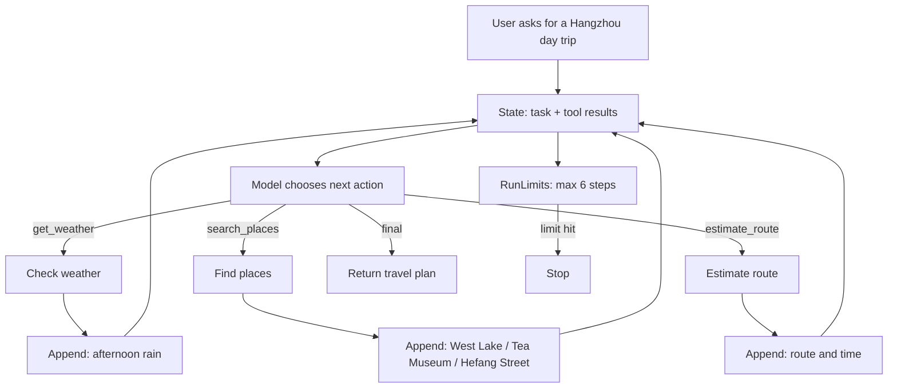

# ReAct: The First Travel Planning Agent Loop

If you have not read the progression yet, start with [05: Agent Loop](../tutorial/05_agent_loop.md). ReAct is not the starting point; it appears after a chatbot needs tools and the next step depends on tool results.

ReAct solves a concrete problem: **sometimes the model must take one step, inspect the result, and only then decide the next step.**

Travel planning is a natural example. A user asks for a relaxed one-day Hangzhou trip with tea, local food, easy walking, and packing advice. The model should not invent the plan in one shot. It should check weather, find places, estimate a route, and then answer.

## Full Code

```python
--8<-- "examples/21_react_loop.py"
```

Run:

```bash
uv run python examples/21_react_loop.py
```

Expected output:

```text
Plan: West Lake in the morning, China National Tea Museum after the rain starts, then Hefang Street for snacks. Pack an umbrella, a light jacket, and comfortable shoes.
[trace] .traces/21_react_loop.jsonl
```

## Why This Looks Like An Agent

This example makes several decisions, not just one tool call:

| Step | Model requests | Python does | Result |
|---|---|---|---|
| 1 | `get_weather` | Looks up tomorrow's Hangzhou weather | Light rain after 15:00 |
| 2 | `search_places` | Finds places for tea, food, easy walking, and rain | West Lake, Tea Museum, Hefang Street |
| 3 | `estimate_route` | Estimates route order and travel time | Morning outdoors, afternoon indoors |
| 4 | `final` | Stops the loop | Returns the plan |

The key boundary: **the model requests actions; Python validates, executes, records, and stops them.**

## Flow



## Core Implementation

```python
--8<-- "src/agent_patterns_lab/patterns/react.py"
```

What to notice:

- `structured_complete(...)` forces the model to return a valid action.
- `FinalAction` ends the loop.
- `AskAction` asks the user for missing information.
- `ToolAction` calls a Python tool and appends the result to `messages`.
- `run_loop(...)` enforces the step budget.

## Text ReAct vs JSON ReAct

The paper often presents ReAct as:

```text
Thought: I need to check the weather.
Action: get_weather[Hangzhou, tomorrow]
Observation: It will rain in the afternoon.
Final: ...
```

This repo keeps the same idea, but uses JSON actions:

```json
{"type":"tool","tool":"get_weather","args":{"city":"Hangzhou","date":"tomorrow"}}
```

JSON is easier to parse, validate, trace, and test.

## When To Use It

- The next step depends on tool output.
- You do not know how many tool calls are needed.
- You need a replayable trace of the model's decisions.

## When Not To Use It

- If one model call is enough, do not build a loop.
- If all steps are fixed, use Prompt Chaining.
- If one tool call is enough, call the tool directly.
- If tools can book, pay, or mutate production data, add policy, guardrails, and human confirmation first.

## References

- [ReAct paper](https://arxiv.org/abs/2210.03629)
- [Prompting Guide: ReAct](https://www.promptingguide.ai/techniques/react)
- [Anthropic: Building effective agents](https://www.anthropic.com/engineering/building-effective-agents)
- [Implementation: `src/agent_patterns_lab/patterns/react.py`](https://github.com/lifeodyssey/agent-patterns-lab/blob/main/src/agent_patterns_lab/patterns/react.py)
- [Example: `examples/21_react_loop.py`](https://github.com/lifeodyssey/agent-patterns-lab/blob/main/examples/21_react_loop.py)
