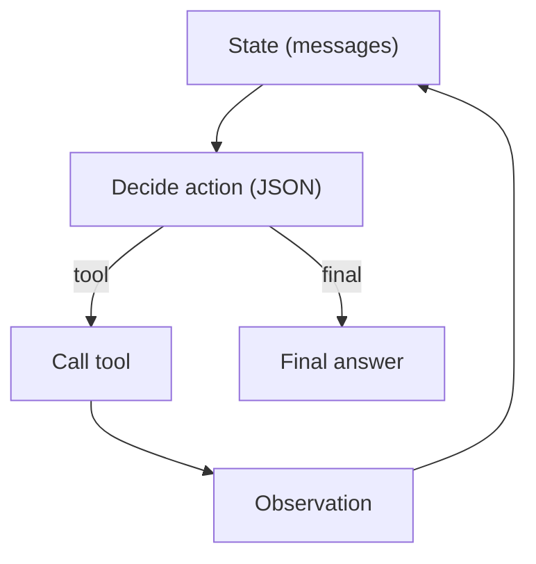

# ReAct (Reason → Act → Observe Loop)

## What Problem It Solves

If the next step depends on observations (tool outputs), you need a **control loop**:

- decide what to do next
- call tools
- update context
- repeat until done

## When to Use

- Unknown number of tool calls.
- The environment is interactive (search, APIs, file ops).
- You need a “stop condition” (final answer).

## Core Flow (Action Schema)

## Evolution Path

- Built on: **Tool calling + Structured output + Loop controller**
- Specializations:
  - **Agentic RAG** = ReAct + retrieval tool + evidence ledger
  - **Governance** hooks = policy/guardrails/HITL around tool calls

## Repo Reference

- Code: `src/agent_patterns_lab/patterns/react.py`
- Example: `examples/21_react_loop.py`
- Tests: `tests/test_react.py`

