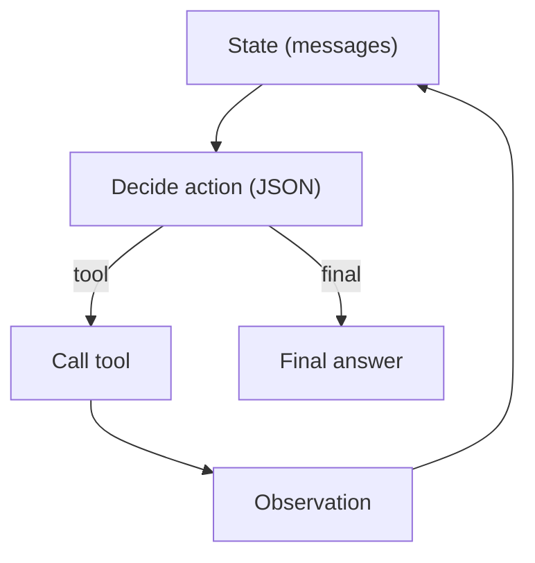

# ReAct (Reason → Act → Observe Loop)

## What Problem It Solves

Classic prompting patterns (e.g., “think then answer”) break down when the agent must **interact with an environment**.

If the next step depends on observations (tool outputs), you need a **control loop** that can:

- decide what to do next
- call tools
- update context
- repeat until done

ReAct is the canonical “agent loop” pattern: **interleave reasoning and acting**, so the agent can ground its next decision in fresh observations.

## When to Use

- Unknown number of tool calls.
- The environment is interactive (search, APIs, file ops).
- You need a “stop condition” (final answer).

## How It Works (Conceptually)

ReAct is a minimal *closed-loop controller*:

1. **State**: current conversation + any scratchpad / ledger.
2. **Decision**: pick the next step (a tool call) *or* finish.
3. **Action**: execute the tool.
4. **Observation**: append tool output back into state.
5. Repeat until a **termination condition** holds.

Compared to “one-shot tool calling”, the loop matters because the agent can:

- recover from partial failures (retry, choose a different tool, ask for clarification)
- adapt when tool outputs are surprising
- stop early when evidence is sufficient

## Core Flow (Action Schema)

## Prompt / Output Format (Two Common Shapes)

Most ReAct implementations use one of these shapes:

1. **Textual**: `Thought:` → `Action:` → `Observation:` (repeat) → `Final:`
2. **Structured** (recommended for tooling): decide a JSON “next action”, e.g.:
   - `{ "type": "tool", "name": "search", "args": {...} }`
   - `{ "type": "final", "answer": "..." }`

This repo uses the **structured** variant so the loop controller can reliably parse actions and log traces.

## Failure Modes & Mitigations

- **Looping / no-progress**: add max steps, stall detection, or “reflect then replan”.
- **Bad tool selection**: add routing, tool descriptions, or a planner step.
- **Hallucinated observations**: enforce “observations must come from tools” + guardrails.
- **High cost**: add caching, budgets, and early-stop conditions.

## Evolution Path

- Built on: **Tool calling + Structured output + Loop controller**
- Specializations:
  - **Agentic RAG** = ReAct + retrieval tool + evidence ledger
  - **Governance** hooks = policy/guardrails/HITL around tool calls
  - **Multi-agent** = run multiple ReAct loops under a coordinator (handoff / manager-worker)

## Repo Reference

- Code: [`src/agent_patterns_lab/patterns/react.py`](https://github.com/lifeodyssey/agent-patterns-lab/blob/main/src/agent_patterns_lab/patterns/react.py)
- Example: [`examples/21_react_loop.py`](https://github.com/lifeodyssey/agent-patterns-lab/blob/main/examples/21_react_loop.py)
- Tests: [`tests/test_react.py`](https://github.com/lifeodyssey/agent-patterns-lab/blob/main/tests/test_react.py)

## References

- Yao et al. (2022). *ReAct: Synergizing Reasoning and Acting in Language Models*. https://arxiv.org/abs/2210.03629
- Prompting Guide — ReAct: https://www.promptingguide.ai/zh/techniques/react
