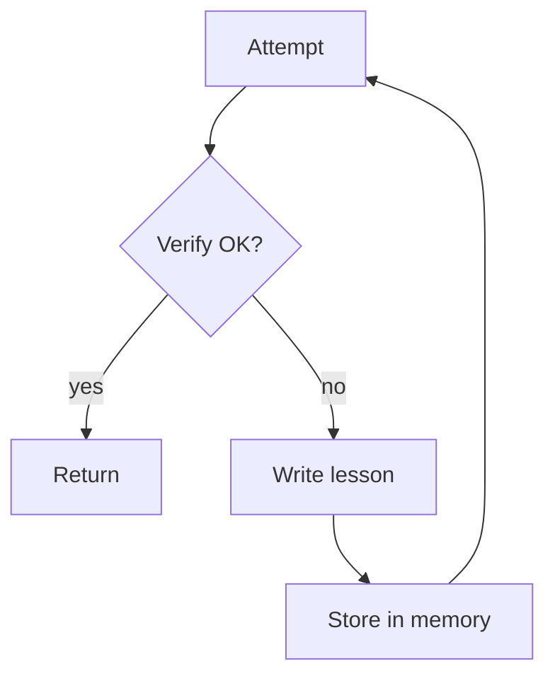

# Reflexion (Learn From Failures via Memory)

## What Problem It Solves

When a system fails repeatedly in similar ways, you want it to **write lessons** and reuse them on retry.

## Core Flow

## How It Works

Reflexion turns “a failed run” into a reusable artifact:

1. Run the agent/pipeline for an attempt.
2. Verify the outcome (checker, tests, constraints, retrieval evidence).
3. If it fails, ask the model to write a **lesson**:
   - what went wrong
   - what to do differently next time
   - a concrete checklist / rule of thumb
4. Store lessons in memory and retrieve them at the start of the next attempt.

The “lesson” is often more valuable than the raw conversation because it is compact and portable.

## Failure Modes & Mitigations

- **Wrong lessons** (the model rationalizes): require evidence for the diagnosis; keep lessons short and testable.
- **Over-general lessons** (“be careful”): enforce a template (symptom → cause → fix).
- **Memory bloat**: deduplicate lessons; keep top-K relevant; add TTL.
- **Applying irrelevant lessons**: retrieve by similarity + add a relevance score; allow the agent to ignore low-confidence lessons.

## Evolution Path

- Extends: Maker-Checker/CoVe by persisting lessons across runs
- In production: pair with **session memory** + **evals** to prevent regressions

## References

- Reflexion: Shinn et al., 2023. citeturn3search1

## Repo Reference

- Code: [`src/agent_patterns_lab/patterns/reflexion.py`](https://github.com/lifeodyssey/agent-patterns-lab/blob/main/src/agent_patterns_lab/patterns/reflexion.py)
- Example: [`examples/42_reflexion.py`](https://github.com/lifeodyssey/agent-patterns-lab/blob/main/examples/42_reflexion.py)
- Tests: [`tests/test_reflexion.py`](https://github.com/lifeodyssey/agent-patterns-lab/blob/main/tests/test_reflexion.py)
