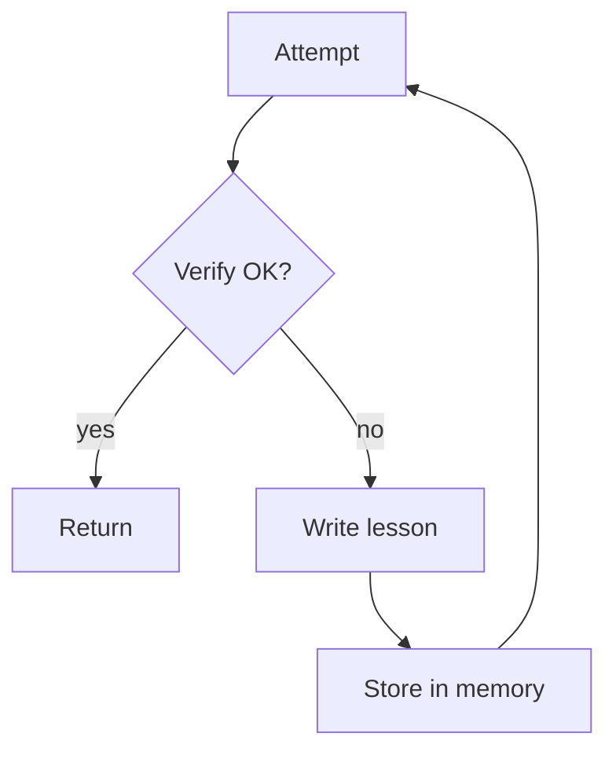

# Reflexion (Learn From Failures via Memory)

## What Problem It Solves

When a system fails repeatedly in similar ways, you want it to **write lessons** and reuse them on retry.

## Core Flow

## Evolution Path

- Extends: Maker-Checker/CoVe by persisting lessons across runs
- In production: pair with **session memory** + **evals** to prevent regressions

## Repo Reference

- Code: `src/agent_patterns_lab/patterns/reflexion.py`
- Example: `examples/42_reflexion.py`
- Tests: `tests/test_reflexion.py`

