# Retrieval Loop (Query → Retrieve → Decide → Refine)

## What Problem It Solves

One-shot retrieval often misses key evidence. A retrieval loop iteratively improves queries based on gaps.

## Core Flow

```mermaid
flowchart TD
  Q["Question"] --> G["Propose query"]
  G --> S["Search"]
  S --> N["Notes (dedup evidence)"]
  N --> D{"Enough evidence?"}
  D -->|no| G
  D -->|yes| A["Answer with citations"]
```

## When to Use

- The first retrieval is often incomplete or off-target.
- You need to build confidence with multiple sources.
- You want “search as an iterative process”, not a single tool call.

## How It Works

1. Generate an initial query from the question.
2. Retrieve documents/snippets.
3. Maintain a **notes/evidence** structure (dedup, track doc IDs).
4. Decide if evidence is sufficient; if not, refine the query based on gaps.
5. Answer with citations to the collected evidence.

## Failure Modes & Mitigations

- **Query drift** (searching the wrong thing): keep a stable objective statement; constrain refinements.
- **Redundant retrieval**: deduplicate by doc ID / hash; cache queries.
- **Prompt injection via retrieved text**: add guardrails; isolate “evidence” from “instructions”.
- **Infinite search**: enforce budgets (max queries, time, tokens).

## Evolution Path

- Comes from: classic “retrieve once → answer”
- Leads to: **Agentic RAG** (retrieval becomes a tool in an agent loop)

## Repo Reference

- Code: [`src/agent_patterns_lab/patterns/retrieval_loop.py`](https://github.com/lifeodyssey/agent-patterns-lab/blob/main/src/agent_patterns_lab/patterns/retrieval_loop.py)
- Example: [`examples/40_retrieval_loop.py`](https://github.com/lifeodyssey/agent-patterns-lab/blob/main/examples/40_retrieval_loop.py)
- Tests: [`tests/test_retrieval_loop.py`](https://github.com/lifeodyssey/agent-patterns-lab/blob/main/tests/test_retrieval_loop.py)
