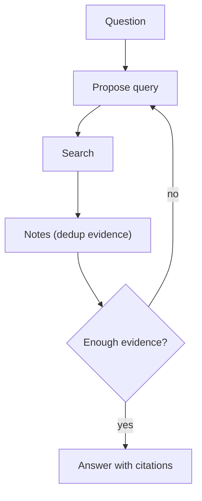

# Retrieval Loop (Query → Retrieve → Decide → Refine)

## What Problem It Solves

One-shot retrieval often misses key evidence. A retrieval loop iteratively improves queries based on gaps.

## Core Flow



## When to Use

- The first retrieval is often incomplete or off-target.
- You need to build confidence with multiple sources.
- You want “search as an iterative process”, not a single tool call.

## When NOT to Use

- Your knowledge base is small and one good query reliably retrieves everything → do one-shot RAG.
- You can write the query deterministically (filters, exact IDs) → make retrieval a workflow step, not an LLM loop.
- You can’t afford iterative cost → add strict budgets and route most queries to a cheaper path.

## How It Works

1. Generate an initial query from the question.
2. Retrieve documents/snippets.
3. Maintain a **notes/evidence** structure (dedup, track doc IDs).
4. Decide if evidence is sufficient; if not, refine the query based on gaps.
5. Answer with citations to the collected evidence.

### Mechanics (how to keep it from becoming a crawler)

- **Notes are structured**: store `{doc_id, url, snippet, claims}` so you can dedupe and cite reliably.
- **Stop conditions are explicit**: budgets + convergence (no new claims in the last N retrieves) beats “I feel confident”.
- **Query refinement is constrained**: keep a stable objective statement; refine around missing facets.
- **Context hygiene**: keep raw retrieved text separate from instructions (prompt injection is normal on the open web).

## Worked Example

```bash
UV_CACHE_DIR=.uv_cache PYTHONPATH=src uv run --no-sync python examples/40_retrieval_loop.py
```

## Failure Modes & Mitigations

- **Query drift** (searching the wrong thing): keep a stable objective statement; constrain refinements.
- **Redundant retrieval**: deduplicate by doc ID / hash; cache queries.
- **Prompt injection via retrieved text**: add guardrails; isolate “evidence” from “instructions”.
- **Infinite search**: enforce budgets (max queries, time, tokens).

## Evolution Path

- Comes from: classic “retrieve once → answer”
- Leads to: **Agentic RAG** (retrieval becomes a tool in an agent loop)

## Repo Reference

- Code: [`src/agent_patterns_lab/patterns/retrieval_loop.py`](https://github.com/lifeodyssey/agent-patterns-lab/blob/main/src/agent_patterns_lab/patterns/retrieval_loop.py)
- Example: [`examples/40_retrieval_loop.py`](https://github.com/lifeodyssey/agent-patterns-lab/blob/main/examples/40_retrieval_loop.py)
- Tests: [`tests/test_retrieval_loop.py`](https://github.com/lifeodyssey/agent-patterns-lab/blob/main/tests/test_retrieval_loop.py)

## References

- Agent Patterns — Research Agent (bounded “search → read → extract → write” loop): https://www.agentpatterns.tech/en/agent-patterns/research-agent
- Iterative retrieval-verification loops (survey-style): https://www.emergentmind.com/topics/iterative-retrieval-verification-loops
