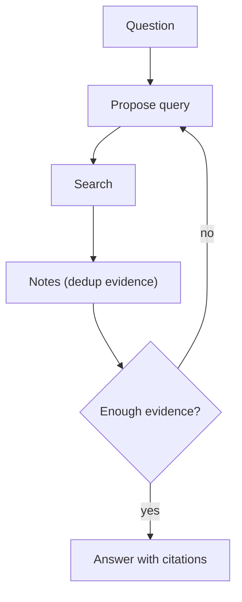

# Retrieval Loop (Query → Retrieve → Decide → Refine)

## What Problem It Solves

One-shot retrieval often misses key evidence. A retrieval loop iteratively improves queries based on gaps.

## Core Flow

## Evolution Path

- Comes from: classic “retrieve once → answer”
- Leads to: **Agentic RAG** (retrieval becomes a tool in an agent loop)

## Repo Reference

- Code: `src/agent_patterns_lab/patterns/retrieval_loop.py`
- Example: `examples/40_retrieval_loop.py`
- Tests: `tests/test_retrieval_loop.py`

