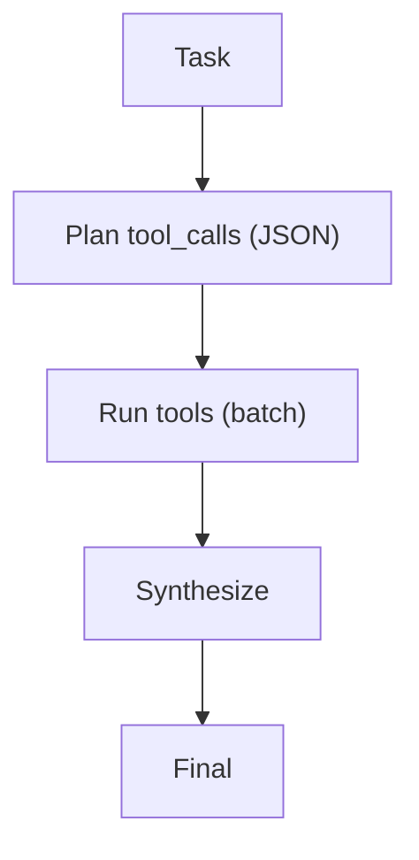

# REWOO (Reasoning Without Observation)

## What Problem It Solves

Tool loops can be slow/expensive due to multiple round-trips. REWOO reduces this by:

- planning tool calls up front
- executing tools in batch
- synthesizing once

## When to Use

- Tool latency dominates, and tool calls are mostly independent.
- You can predict the needed tool calls without intermediate observations.
- You want fewer LLM round-trips (cost + latency control).

## When NOT to Use

- The right next tool depends on what you just observed → use **ReAct**.
- Tool calls have tight dependencies (call B only if A returns X) → REWOO will over-fetch or miss branches.
- You need strong recovery from tool failures mid-run → a loop controller is usually safer than a single batch.

## Core Flow



## How It Works

REWOO trades adaptivity for fewer LLM round-trips:

1. The model plans all (or most) tool calls up front as a structured list.
2. The system executes tool calls in batch (possibly in parallel).
3. The model synthesizes a final answer using all observations at once.

This is useful when tool calling latency dominates and the task can be decomposed reliably.

### Mechanics (what to make explicit)

- **Plan format**: represent tool calls as a list of `{name, args}` plus optional dependency keys.
- **Batch execution policy**: parallelize only independent calls; handle partial failures (missing results) explicitly.
- **Fallback path**: if synthesis detects missing info, do one more batch or drop back to ReAct.

## Worked Example

```bash
UV_CACHE_DIR=.uv_cache PYTHONPATH=src uv run --no-sync python examples/52_rewoo.py
```

## Failure Modes & Mitigations

- **Plan is wrong without observations**: keep plans short; allow a second planning round; fall back to ReAct when needed.
- **Missing intermediate decisions**: restrict REWOO to tasks where tool calls are independent.
- **Tool errors break the batch**: add per-tool retries and partial results handling.
- **Over-fetching**: add budgets and pruning for redundant tool calls.

## Evolution Path

- A “workflow” alternative to ReAct when tool costs dominate
- Often combined with: **verification** after synthesis

## Repo Reference

- Code: [`src/agent_patterns_lab/patterns/rewoo.py`](https://github.com/lifeodyssey/agent-patterns-lab/blob/main/src/agent_patterns_lab/patterns/rewoo.py)
- Example: [`examples/52_rewoo.py`](https://github.com/lifeodyssey/agent-patterns-lab/blob/main/examples/52_rewoo.py)
- Tests: [`tests/test_rewoo.py`](https://github.com/lifeodyssey/agent-patterns-lab/blob/main/tests/test_rewoo.py)

## References

- Xu et al. (2023). *ReWOO: Decoupling Reasoning from Observations for Efficient Augmented Language Models*. https://arxiv.org/abs/2305.18323
