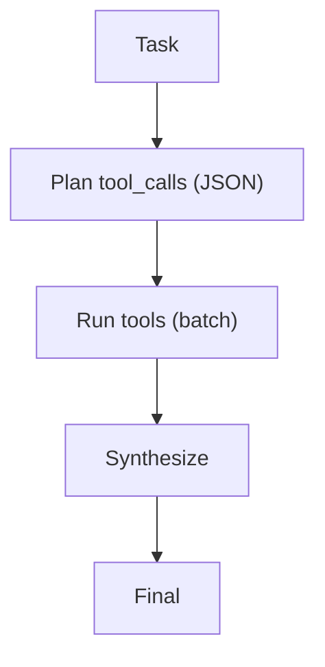

# REWOO (Reasoning Without Observation)

## What Problem It Solves

Tool loops can be slow/expensive due to multiple round-trips. REWOO reduces this by:

- planning tool calls up front
- executing tools in batch
- synthesizing once

## Core Flow

## Evolution Path

- A “workflow” alternative to ReAct when tool costs dominate
- Often combined with: **verification** after synthesis

## Repo Reference

- Code: `src/agent_patterns_lab/patterns/rewoo.py`
- Example: `examples/52_rewoo.py`
- Tests: `tests/test_rewoo.py`

