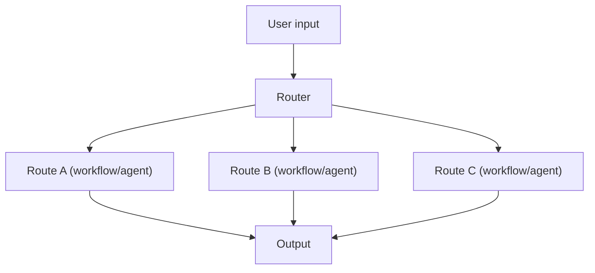

# Routing (Rule-based / LLM-based)

## What Problem It Solves

When you have multiple task types, a single prompt/pipeline becomes a compromise.
Routing chooses the best **specialized** flow for the input.

## When to Use

- Distinct intents (math vs writing vs retrieval vs code).
- Different cost/latency budgets per route.
- You want explicit control over “what happens next”.

## Core Flow

## Evolution Path

- Comes from: **Prompt Chaining** (multiple workflows exist)
- Leads to: **Handoff / Multi-agent** (routing between agents), **Agentic RAG** (route to retrieve)

## Repo Reference

- Code: `src/agent_patterns_lab/patterns/routing.py`
- Example: `examples/12_routing.py`
- Tests: `tests/test_routing.py`

