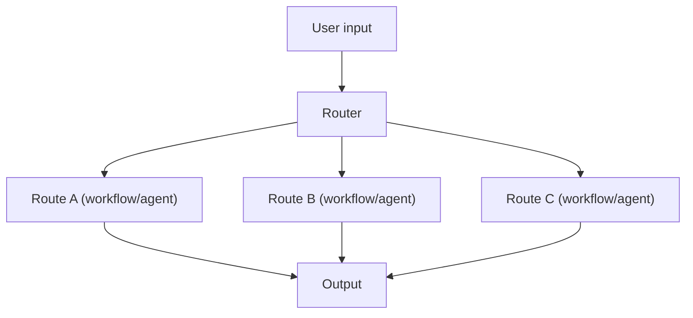

# Routing (Rule-based / LLM-based)

## What Problem It Solves

When you have multiple task types, a single prompt/pipeline becomes a compromise.
Routing chooses the best **specialized** flow for the input.

## When to Use

- Distinct intents (math vs writing vs retrieval vs code).
- Different cost/latency budgets per route.
- You want explicit control over “what happens next”.

## Core Flow

## How It Works

Routing is a *decision point* that picks the next controller:

- **Rule-based router**: fast and predictable (regex/keywords/simple heuristics).
- **LLM-based router**: more flexible (classify intent, pick tools/agents), but can misroute.

Common routing targets:

- workflows (prompt chains)
- different tools / tool sets
- specialized agents (e.g., “researcher” vs “coder”)

## Failure Modes & Mitigations

- **Misroute**: add confidence thresholds; fall back to a safe default route.
- **Overfitting rules**: keep rules minimal; log misroutes and iterate.
- **Router prompt drift**: require structured route outputs; add eval tasks for routing.
- **Cost explosion**: route to cheaper models first; escalate only when needed.

## Evolution Path

- Comes from: **Prompt Chaining** (multiple workflows exist)
- Leads to: **Handoff / Multi-agent** (routing between agents), **Agentic RAG** (route to retrieve)

## Repo Reference

- Code: [`src/agent_patterns_lab/patterns/routing.py`](https://github.com/lifeodyssey/agent-patterns-lab/blob/main/src/agent_patterns_lab/patterns/routing.py)
- Example: [`examples/12_routing.py`](https://github.com/lifeodyssey/agent-patterns-lab/blob/main/examples/12_routing.py)
- Tests: [`tests/test_routing.py`](https://github.com/lifeodyssey/agent-patterns-lab/blob/main/tests/test_routing.py)
