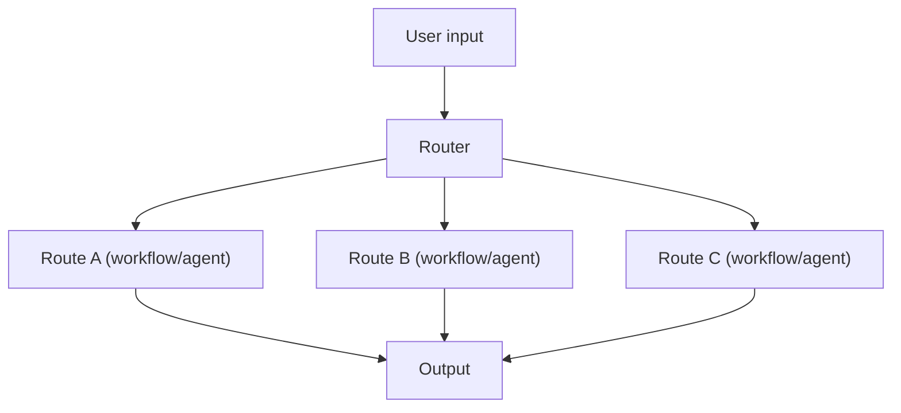

# Routing (Rule-based / LLM-based)

## TL;DR (One Sentence)

Routing is a **gate** that picks the best next controller (workflow/agent/toolset) for the current input, instead of forcing one prompt to handle everything.

## You Probably Need This When (Symptoms)

- You have clearly different task types (e.g., math vs research vs code).
- Different tasks need different tools / budgets / safety policies.
- You keep arguing about “why did it do that next?” and you need an explicit decision point.

## What Problem It Solves

When you have multiple task types, a single prompt/pipeline becomes a compromise.
Routing chooses the best **specialized** flow for the input.

## When to Use

- Distinct intents (math vs writing vs retrieval vs code).
- Different cost/latency budgets per route.
- You want explicit control over “what happens next”.

## When NOT to Use

- You only have 1–2 “routes” and the difference is tiny → keep a single prompt.
- The task needs **dynamic delegation over time** (the right specialist changes mid-run) → consider **handoff** or a multi-agent orchestrator.
- You can’t define what “correct routing” even means → you’ll never be able to debug misroutes (start with a simpler classifier + logs).

## Core Flow



## Walkthrough (A Minimal Routing Decision)

Input: “Compute 2+2.”

1. Router outputs a route ID (e.g., `"math"`).
2. The system runs the controller bound to that route (workflow or agent).
3. The result returns, with the route recorded in traces/logs.

Routing becomes useful the moment you need **different tool allowlists or budgets** per route.

## How It Works

Routing is a *decision point* that picks the next controller:

- **Rule-based router**: fast and predictable (regex/keywords/simple heuristics).
- **LLM-based router**: more flexible (classify intent, pick tools/agents), but can misroute.

Common routing targets:

- workflows (prompt chains)
- different tools / tool sets
- specialized agents (e.g., “researcher” vs “coder”)

### Mechanics (what makes routing stable)

- **Route IDs are a contract**: keep a small, named set (`"math"`, `"research"`, `"code"`, …).
- **Confidence + fallback**: when the router is unsure, fall back to a safe default route (or ask a clarifying question).
- **Per-route policies**: bind tool allowlists and budgets to the route (e.g., “research route can browse; answer route can’t”).
- **Routing evals**: measure misroute rate on a small labeled set; it’s the fastest way to keep routing from regressing.

## Worked Example

```bash
UV_CACHE_DIR=.uv_cache PYTHONPATH=src uv run --no-sync python examples/12_routing.py
```

??? example "Example code (`examples/12_routing.py`)"
    ```python
    --8<-- "examples/12_routing.py"
    ```

## Failure Modes & Mitigations

- **Misroute**: add confidence thresholds; fall back to a safe default route.
- **Overfitting rules**: keep rules minimal; log misroutes and iterate.
- **Router prompt drift**: require structured route outputs; add eval tasks for routing.
- **Cost explosion**: route to cheaper models first; escalate only when needed.

## Evolution Path

- Comes from: **Prompt Chaining** (multiple workflows exist)
- Leads to: **Handoff / Multi-agent** (routing between agents), **Agentic RAG** (route to retrieve)

## Repo Reference

- Code: [`src/agent_patterns_lab/patterns/routing.py`](https://github.com/lifeodyssey/agent-patterns-lab/blob/main/src/agent_patterns_lab/patterns/routing.py)
- Example: [`examples/12_routing.py`](https://github.com/lifeodyssey/agent-patterns-lab/blob/main/examples/12_routing.py)
- Tests: [`tests/test_routing.py`](https://github.com/lifeodyssey/agent-patterns-lab/blob/main/tests/test_routing.py)

## References

- Azure Architecture Center — AI agent design patterns (routing discussed under handoff + deterministic routing): https://learn.microsoft.com/en-us/azure/architecture/ai-ml/guide/ai-agent-design-patterns
- Agent Patterns — Routing Agent Pattern (practical): https://www.agentpatterns.tech/en/agent-patterns
