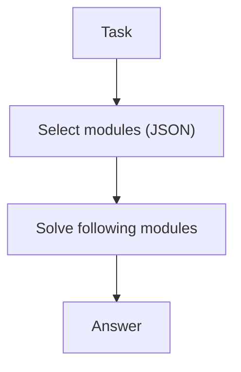

# Self-Discovery (Select Reasoning Modules)

## What Problem It Solves

Different tasks benefit from different strategies (check, simplify, decompose…).  
Self-Discovery makes the model **choose** modules first, then solve with that guidance.

## When to Use

- You want strategy to be explicit (“which playbook are we using?”).
- You have a small set of reusable reasoning checklists/modules.
- You want more consistency across similar tasks.

## When NOT to Use

- Your module library is vague or huge → selection becomes random; start by shrinking and sharpening modules.
- The task is simple enough for a single prompt → module selection adds a call without adding signal.
- You can’t tolerate strategy drift (“select modules then ignore them”) → prefer deterministic workflows.

## Core Flow



## How It Works

Self-Discovery separates “strategy choice” from “execution”:

1. Maintain a small library of reasoning modules (e.g., decompose, verify, search, simplify).
2. Ask the model to select modules relevant to the task (structured output).
3. Run a solve step that explicitly follows the chosen modules as guidance.

This improves consistency because the model commits to a strategy before diving into details.

### Mechanics (how to keep modules useful)

- **Modules are checklists**: each module should say what to do and what to output (not a motivational slogan).
- **Selection is bounded**: pick at most `k` modules; force a short justification (“why these, not others”).
- **Composition matters**: module order is part of the strategy (decompose → solve → verify is different from verify → decompose).
- **Re-select on failure**: after a quick self-check, allow swapping modules when the chosen set is clearly wrong.

## Worked Example

```bash
UV_CACHE_DIR=.uv_cache PYTHONPATH=src uv run --no-sync python examples/55_self_discovery.py
```

## Failure Modes & Mitigations

- **Module list too vague**: make modules concrete (inputs/outputs/checklists).
- **Wrong module selection**: add examples; allow re-selection after a quick self-check.
- **Strategy theater** (selects modules but ignores them): enforce “show work” checkpoints per module.
- **Too many modules**: cap selection size; keep a minimal library.

## Evolution Path

- Often used before planning/search loops
- Can be combined with: PER or LATS as “strategy selection”

## Repo Reference

- Code: [`src/agent_patterns_lab/patterns/self_discovery.py`](https://github.com/lifeodyssey/agent-patterns-lab/blob/main/src/agent_patterns_lab/patterns/self_discovery.py)
- Example: [`examples/55_self_discovery.py`](https://github.com/lifeodyssey/agent-patterns-lab/blob/main/examples/55_self_discovery.py)
- Tests: [`tests/test_self_discovery.py`](https://github.com/lifeodyssey/agent-patterns-lab/blob/main/tests/test_self_discovery.py)

## References

- Zhou et al. (2024). *Self-Discover: Large Language Models Self-Compose Reasoning Structures*: https://arxiv.org/abs/2402.03620
- Agent Patterns — Self-Discovery pattern page: https://agent-patterns.readthedocs.io/en/stable/patterns/self-discovery.html
