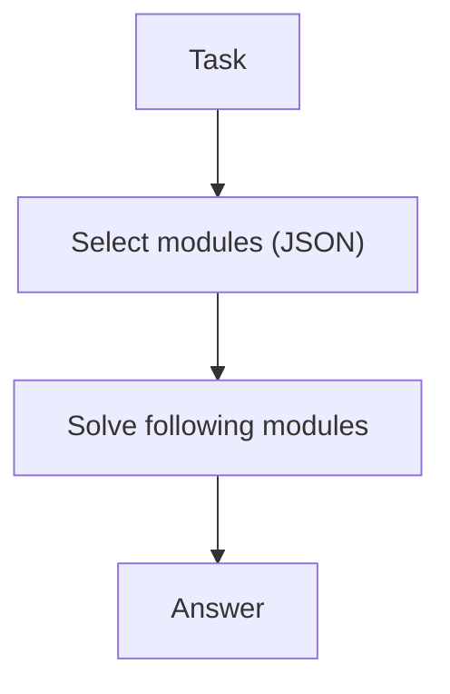

# Self-Discovery (Select Reasoning Modules)

## What Problem It Solves

Different tasks benefit from different strategies (check, simplify, decompose…).  
Self-Discovery makes the model **choose** modules first, then solve with that guidance.

## Core Flow

## Evolution Path

- Often used before planning/search loops
- Can be combined with: PER or LATS as “strategy selection”

## Repo Reference

- Code: `src/agent_patterns_lab/patterns/self_discovery.py`
- Example: `examples/55_self_discovery.py`
- Tests: `tests/test_self_discovery.py`

