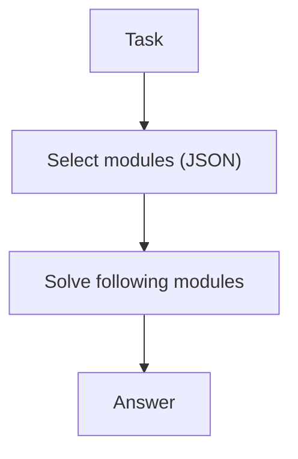

# Self-Discovery (Select Reasoning Modules)

## What Problem It Solves

Different tasks benefit from different strategies (check, simplify, decompose…).  
Self-Discovery makes the model **choose** modules first, then solve with that guidance.

## Core Flow

## How It Works

Self-Discovery separates “strategy choice” from “execution”:

1. Maintain a small library of reasoning modules (e.g., decompose, verify, search, simplify).
2. Ask the model to select modules relevant to the task (structured output).
3. Run a solve step that explicitly follows the chosen modules as guidance.

This improves consistency because the model commits to a strategy before diving into details.

## Failure Modes & Mitigations

- **Module list too vague**: make modules concrete (inputs/outputs/checklists).
- **Wrong module selection**: add examples; allow re-selection after a quick self-check.
- **Strategy theater** (selects modules but ignores them): enforce “show work” checkpoints per module.
- **Too many modules**: cap selection size; keep a minimal library.

## Evolution Path

- Often used before planning/search loops
- Can be combined with: PER or LATS as “strategy selection”

## Repo Reference

- Code: [`src/agent_patterns_lab/patterns/self_discovery.py`](https://github.com/lifeodyssey/agent-patterns-lab/blob/main/src/agent_patterns_lab/patterns/self_discovery.py)
- Example: [`examples/55_self_discovery.py`](https://github.com/lifeodyssey/agent-patterns-lab/blob/main/examples/55_self_discovery.py)
- Tests: [`tests/test_self_discovery.py`](https://github.com/lifeodyssey/agent-patterns-lab/blob/main/tests/test_self_discovery.py)
