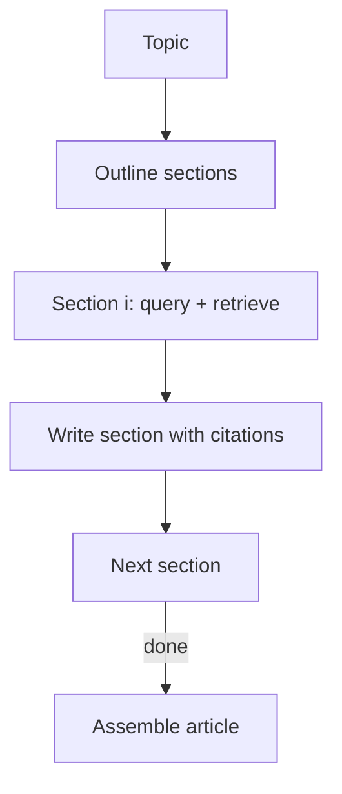

# STORM-like Research Writing (Outline → Section Research → Draft)

## What Problem It Solves

Research writing is not one query. You need:

- outline first
- retrieve evidence per section
- write sections grounded in evidence
- assemble a final article

## When to Use

- You’re producing a long-form artifact (article/report), not a one-off answer.
- You need evidence per section (not a single global “context dump”).
- You want an editorial pass to reduce redundancy and tighten structure.

## When NOT to Use

- The user wants a short answer or quick lookup → a retrieval loop / agentic RAG is enough.
- You can’t afford many retrieval + writing calls → STORM is high-cost by design.
- Citations don’t matter → STORM’s structure is overhead.

## Core Flow



## How It Works

STORM-style writing treats an article as a structured artifact:

1. Produce an **outline** (sections + key questions per section).
2. For each section:
   - retrieve evidence for the section’s questions
   - write a grounded section that cites evidence
3. Assemble sections into a coherent article.
4. Optionally run a final **editor** pass (consistency, redundancy, tone, missing citations).

The critical design choice is that retrieval is **section-scoped**, which prevents the model from mixing unrelated evidence.

### Mechanics (what makes it STORM-like)

- **Pre-writing first**: treat outline quality as its own deliverable (coverage beats early drafting).
- **Section-scoped retrieval**: each section has its own questions and evidence pool.
- **Evidence ledger per section**: makes citations auditable and reduces cross-section contamination.
- **Editor pass is optional but useful**: a final pass that removes duplication, fixes section order, and checks citation density.

## Worked Example

```bash
UV_CACHE_DIR=.uv_cache PYTHONPATH=src uv run --no-sync python examples/56_storm.py
```

## Failure Modes & Mitigations

- **Shallow outline**: iterate outline with a rubric (coverage, order, audience).
- **Evidence mixing**: keep per-section evidence ledgers; cite per paragraph.
- **Long-context overflow**: summarize per section; persist notes; avoid feeding full corpora.
- **Hallucinated citations**: require doc IDs from the retriever; verify citations exist.

## Evolution Path

- Built on: **Retrieval Loop** patterns
- Often combined with: **Agentic RAG** (dynamic retrieval per section)

## Repo Reference

- Code: [`src/agent_patterns_lab/patterns/storm.py`](https://github.com/lifeodyssey/agent-patterns-lab/blob/main/src/agent_patterns_lab/patterns/storm.py)
- Example: [`examples/56_storm.py`](https://github.com/lifeodyssey/agent-patterns-lab/blob/main/examples/56_storm.py)
- Tests: [`tests/test_storm.py`](https://github.com/lifeodyssey/agent-patterns-lab/blob/main/tests/test_storm.py)

## References

- Stanford STORM project: https://storm-project.stanford.edu/research/storm/
- Shao et al. (2024). *Assisting in Writing Wikipedia-like Articles From Scratch with Large Language Models*: https://arxiv.org/abs/2402.14207
- Agent Patterns — STORM pattern page: https://agent-patterns.readthedocs.io/en/stable/patterns/storm.html
