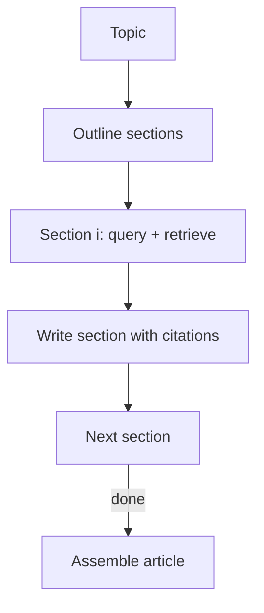

# STORM-like Research Writing

## What Problem It Solves

Research writing is not one query. You need:

- outline first
- retrieve evidence per section
- write sections grounded in evidence
- assemble a final article

## Core Flow

## How It Works

STORM-style writing treats an article as a structured artifact:

1. Produce an **outline** (sections + key questions per section).
2. For each section:
   - retrieve evidence for the section’s questions
   - write a grounded section that cites evidence
3. Assemble sections into a coherent article.
4. Optionally run a final **editor** pass (consistency, redundancy, tone, missing citations).

The critical design choice is that retrieval is **section-scoped**, which prevents the model from mixing unrelated evidence.

## Failure Modes & Mitigations

- **Shallow outline**: iterate outline with a rubric (coverage, order, audience).
- **Evidence mixing**: keep per-section evidence ledgers; cite per paragraph.
- **Long-context overflow**: summarize per section; persist notes; avoid feeding full corpora.
- **Hallucinated citations**: require doc IDs from the retriever; verify citations exist.

## Evolution Path

- Built on: **Retrieval Loop** patterns
- Often combined with: **Agentic RAG** (dynamic retrieval per section)

## Repo Reference

- Code: [`src/agent_patterns_lab/patterns/storm.py`](https://github.com/lifeodyssey/agent-patterns-lab/blob/main/src/agent_patterns_lab/patterns/storm.py)
- Example: [`examples/56_storm.py`](https://github.com/lifeodyssey/agent-patterns-lab/blob/main/examples/56_storm.py)
- Tests: [`tests/test_storm.py`](https://github.com/lifeodyssey/agent-patterns-lab/blob/main/tests/test_storm.py)
