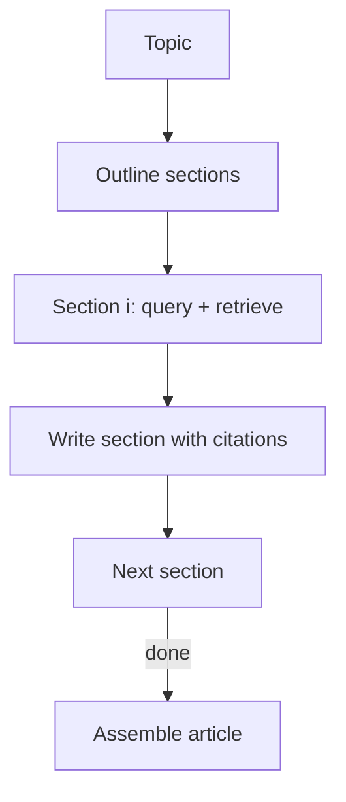

# STORM-like Research Writing

## What Problem It Solves

Research writing is not one query. You need:

- outline first
- retrieve evidence per section
- write sections grounded in evidence
- assemble a final article

## Core Flow

## Evolution Path

- Built on: **Retrieval Loop** patterns
- Often combined with: **Agentic RAG** (dynamic retrieval per section)

## Repo Reference

- Code: `src/agent_patterns_lab/patterns/storm.py`
- Example: `examples/56_storm.py`
- Tests: `tests/test_storm.py`

