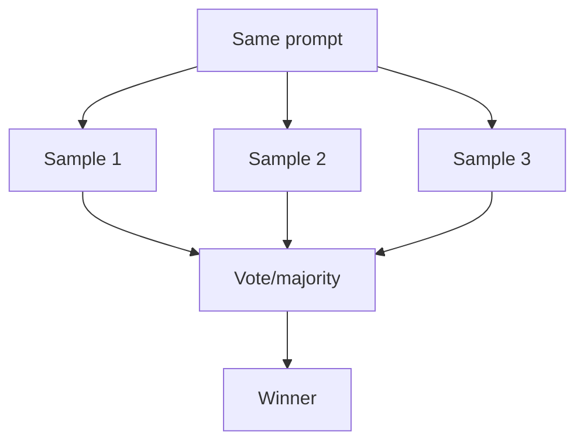

# Voting / Self-Consistency

## What Problem It Solves

For many prompts, the model is stochastic. Voting reduces variance by sampling multiple answers and selecting a winner.

## When to Use

- Answers are short and easy to normalize.
- The task is cheap enough to sample N times.
- You want robustness more than latency.

## Core Flow

## How It Works

Voting exploits diversity across samples:

1. Generate `N` candidates from the same input (often with higher temperature).
2. **Normalize** outputs if possible (e.g., extract final answer, parse JSON).
3. Select the best candidate via:
   - majority vote on identical normalized answers, or
   - a separate “judge” model / rubric, or
   - pairwise tournament (A vs B vs C…)

## Failure Modes & Mitigations

- **No clear majority**: use a judge rubric; increase N; fall back to maker-checker.
- **Systematic bias** (all samples wrong): add retrieval / verification, not more voting.
- **Hard to normalize**: enforce structured outputs; vote on derived metrics.
- **Cost**: vote only on hard inputs (route easy ones to single-shot).

## Evolution Path

- Often paired with: **Maker-Checker**, **CoVe** (verify claims after voting)
- In production: add **evals** to detect regressions

## Repo Reference

- Code: [`src/agent_patterns_lab/patterns/voting.py`](https://github.com/lifeodyssey/agent-patterns-lab/blob/main/src/agent_patterns_lab/patterns/voting.py)
- Example: [`examples/31_voting.py`](https://github.com/lifeodyssey/agent-patterns-lab/blob/main/examples/31_voting.py)
- Tests: [`tests/test_voting.py`](https://github.com/lifeodyssey/agent-patterns-lab/blob/main/tests/test_voting.py)
