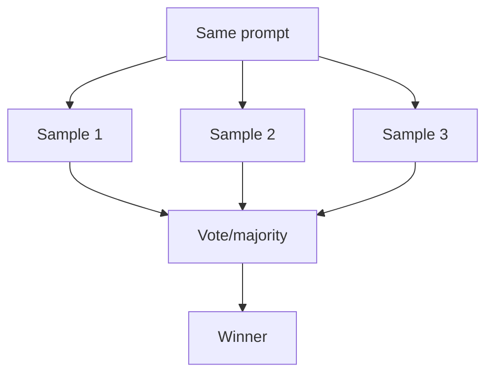

# Voting / Self-Consistency

## What Problem It Solves

For many prompts, the model is stochastic. Voting reduces variance by sampling multiple answers and selecting a winner.

## When to Use

- Answers are short and easy to normalize.
- The task is cheap enough to sample N times.
- You want robustness more than latency.

## Core Flow

## Evolution Path

- Often paired with: **Maker-Checker**, **CoVe** (verify claims after voting)
- In production: add **evals** to detect regressions

## Repo Reference

- Code: `src/agent_patterns_lab/patterns/voting.py`
- Example: `examples/31_voting.py`
- Tests: `tests/test_voting.py`

