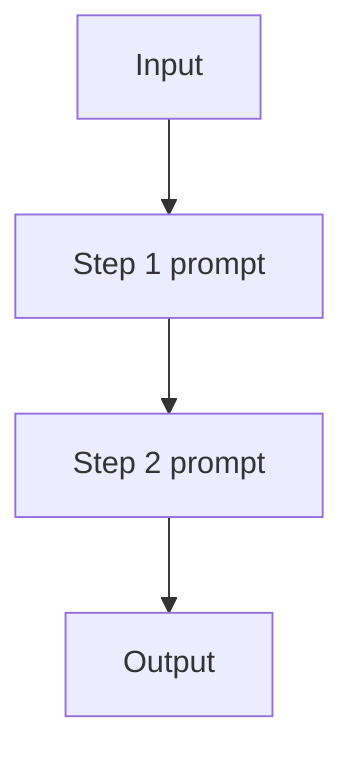

# Prompt Chaining (Workflow)

## What Problem It Solves

Single prompts often mix multiple steps (extract → rewrite → format), which increases error rate.  
Prompt chaining makes the control flow **explicit**: each step does one thing.

## When to Use

- The steps are known ahead of time.
- You want intermediate outputs for debugging.
- You do **not** need tool observations mid-run.

## Core Flow

## How It Works

Prompt chaining turns an “implicit multi-step prompt” into an explicit pipeline:

1. Define **step boundaries** (each step has one responsibility).
2. Choose **interfaces** between steps (plain text, or better: structured JSON).
3. Execute steps in order, optionally recording all intermediate artifacts.
4. Add **validation** at step boundaries (schema checks, constraints, guardrails).

This reduces error rate because each step is simpler, and failures become local and debuggable.

## Failure Modes & Mitigations

- **Error propagation** (bad step 1 poisons step 2): validate early; add repair loops per step.
- **Over-fragmentation** (too many steps): merge steps until each adds clear value.
- **Brittle interfaces** (format drift): use structured output + strict parsing.
- **High latency/cost**: cache intermediate results; short-circuit when a step can be skipped.

## Variants

- **Fan-out / fan-in**: generate multiple candidates at a step, then select/merge downstream.
- **Branching workflow**: add routing to choose which chain to run.

## Evolution Path

- Comes from: **Single-shot prompting**
- Often combined with: **Structured output** (for step outputs), **Routing** (choose a chain)
- If you need environment feedback: move to **ReAct agent loop**

## Repo Reference

- Code: [`src/agent_patterns_lab/patterns/workflow_chaining.py`](https://github.com/lifeodyssey/agent-patterns-lab/blob/main/src/agent_patterns_lab/patterns/workflow_chaining.py)
- Example: [`examples/11_prompt_chaining.py`](https://github.com/lifeodyssey/agent-patterns-lab/blob/main/examples/11_prompt_chaining.py)
- Tests: [`tests/test_workflow_chaining.py`](https://github.com/lifeodyssey/agent-patterns-lab/blob/main/tests/test_workflow_chaining.py)
