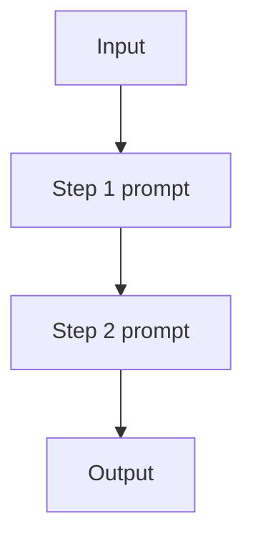

# Prompt Chaining (Workflow)

## TL;DR (One Sentence)

Prompt chaining is a **fixed workflow**: split one fuzzy prompt into a sequence of smaller steps with explicit I/O contracts.

## You Probably Need This When (Symptoms)

- You can list the steps upfront.
- You want intermediate artifacts to debug and regression-test.
- You don’t need tool observations to decide the next step (otherwise you want an agent loop).

## What Problem It Solves

Single prompts often mix multiple steps (extract → rewrite → format), which increases error rate.  
Prompt chaining makes the control flow **explicit**: each step does one thing.

## When to Use

- The steps are known ahead of time.
- You want intermediate outputs for debugging.
- You do **not** need tool observations mid-run.

## When NOT to Use

- The next step depends on **observations** (tool outputs) you can’t predict upfront → use an **agent loop** (ReAct).
- You only have one fuzzy step (“just write a short reply”) → chaining adds latency without clarity.
- You’re extremely latency-sensitive → prefer fewer model calls (merge steps, or use a cheaper model for early steps).

## Core Flow



## Walkthrough (Two Steps, No Surprises)

Think of it like a tiny pipeline:

1. Step 1 produces an intermediate artifact (e.g., extracted bullets).
2. Step 2 consumes that artifact and produces the final output (e.g., a formatted answer).

If you can’t name the intermediate artifact, the chain usually isn’t buying you much.

## How It Works

Prompt chaining turns an “implicit multi-step prompt” into an explicit pipeline:

1. Define **step boundaries** (each step has one responsibility).
2. Choose **interfaces** between steps (plain text, or better: structured JSON).
3. Execute steps in order, optionally recording all intermediate artifacts.
4. Add **validation** at step boundaries (schema checks, constraints, guardrails).

This reduces error rate because each step is simpler, and failures become local and debuggable.

### Mechanics (what to make explicit)

- **Contracts**: define what each step must output (schema or strict format).
- **State passing**: decide what flows forward (full context vs summaries vs structured fields).
- **Stop conditions**: allow short-circuiting (skip step 3 if step 2 says “already done”).
- **Caching**: cache stable steps (classification, extraction) to avoid paying twice.

## Worked Example

```bash
UV_CACHE_DIR=.uv_cache PYTHONPATH=src uv run --no-sync python examples/11_prompt_chaining.py
```

??? example "Example code (`examples/11_prompt_chaining.py`)"
    ```python
    --8<-- "examples/11_prompt_chaining.py"
    ```

## Failure Modes & Mitigations

- **Error propagation** (bad step 1 poisons step 2): validate early; add repair loops per step.
- **Over-fragmentation** (too many steps): merge steps until each adds clear value.
- **Brittle interfaces** (format drift): use structured output + strict parsing.
- **High latency/cost**: cache intermediate results; short-circuit when a step can be skipped.

## Variants

- **Fan-out / fan-in**: generate multiple candidates at a step, then select/merge downstream.
- **Branching workflow**: add routing to choose which chain to run.

## Evolution Path

- Comes from: **Single-shot prompting**
- Often combined with: **Structured output** (for step outputs), **Routing** (choose a chain)
- If you need environment feedback: move to **ReAct agent loop**

## Repo Reference

- Code: [`src/agent_patterns_lab/patterns/workflow_chaining.py`](https://github.com/lifeodyssey/agent-patterns-lab/blob/main/src/agent_patterns_lab/patterns/workflow_chaining.py)
- Example: [`examples/11_prompt_chaining.py`](https://github.com/lifeodyssey/agent-patterns-lab/blob/main/examples/11_prompt_chaining.py)
- Tests: [`tests/test_workflow_chaining.py`](https://github.com/lifeodyssey/agent-patterns-lab/blob/main/tests/test_workflow_chaining.py)

## References

- Azure Architecture Center — AI agent design patterns (Sequential orchestration): https://learn.microsoft.com/en-us/azure/architecture/ai-ml/guide/ai-agent-design-patterns
- Microsoft Agent Framework — Sequential orchestration: https://learn.microsoft.com/en-us/agent-framework/user-guide/workflows/orchestrations/sequential
