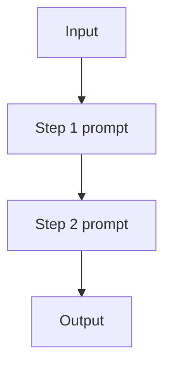

# Prompt Chaining (Workflow)

## What Problem It Solves

Single prompts often mix multiple steps (extract → rewrite → format), which increases error rate.  
Prompt chaining makes the control flow **explicit**: each step does one thing.

## When to Use

- The steps are known ahead of time.
- You want intermediate outputs for debugging.
- You do **not** need tool observations mid-run.

## Core Flow

## Evolution Path

- Comes from: **Single-shot prompting**
- Often combined with: **Structured output** (for step outputs), **Routing** (choose a chain)
- If you need environment feedback: move to **ReAct agent loop**

## Repo Reference

- Code: `src/agent_patterns_lab/patterns/workflow_chaining.py`
- Example: `examples/11_prompt_chaining.py`
- Tests: `tests/test_workflow_chaining.py`

