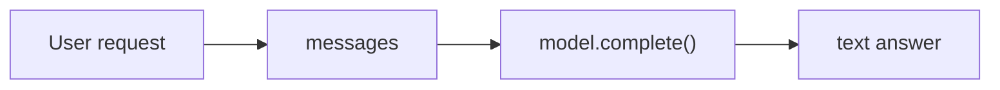

# 00: Minimal Chatbot

Do not start with agents. Start with the smallest chatbot: send messages to a model and get text back.

This step is plain, but it matters.
Agent systems become complicated because this tiny chatbot starts to break:
it forgets, guesses, lacks tools, and cannot decide what to do next.

## What Problem It Solves

A minimal chatbot solves one job: pass a natural-language request to a model.

## How it works

The user asks:

> Plan a one-day trip in Hangzhou.

You wrap that request as a message, call the model, and receive text. No tools. No memory. No loop.



That is the starting point.

## Minimal runnable example

```python
--8<-- "examples/00_single_shot.py"
```

Run:

```bash
uv run python examples/00_single_shot.py
```

## When it is enough

This version is fine when the task is truly one-shot:

- Explain a concept.
- Rewrite a paragraph.
- Summarize text the user already provided.
- Draft something that does not need live facts.

Its strength is that you can see every moving part.

## When it breaks

This version looks useful, but it has sharp limits:

- It does not know live weather.
- It does not know opening hours.
- It does not return stable fields for a UI.
- It does not reliably remember earlier turns.
- It has no replayable path for why it answered that way.

That is the start of the pattern map.
We do not jump to “agent” immediately.
We watch the small chatbot fail, then add the smallest pattern that fixes the failure.

## Common failure modes

- The user asks “Is it raining at West Lake today?” and the model guesses.
- The user says “My budget is 300 RMB” and the next answer forgets it.
- The UI needs fields like attraction, time, and transport, but the model returns prose.
- You ask why Lingyin Temple is scheduled in the afternoon, and there is no trace to inspect.

Each failure points to the next pattern.
Forgetting leads to conversation history.
Unstable output leads to structured output.
Missing facts lead to tool calling.
Multi-step decisions lead to an agent loop.

Next: [01: Conversation History](01_conversation.md).

## Appendix: what real LLM APIs look like

The example uses `MockLLM`. That is intentional.
The app wants one simple thing: send messages, get text back.
Provider APIs do not agree on the details.

So the tutorial keeps one small boundary:

```python
class Model(Protocol):
    def complete(self, messages: Sequence[Message], *, tracer: Tracer | None = None) -> str: ...
```

Pattern code depends on that interface.
`MockLLM`, `OpenAIChatModel`, and `AnthropicMessagesModel` can all sit behind it.
A future Gemini or DeepSeek adapter should do the same.

### Common API shapes

| Provider | Request shape | Where text usually comes from | Docs |
|---|---|---|---|
| OpenAI Responses API | `POST /v1/responses`, usually with `model` and `input`. It is OpenAI's more general interface for text, tools, and state. | SDKs often expose `response.output_text`; lower-level responses can be item/block based. | [Responses API](https://platform.openai.com/docs/api-reference/responses/create?api-mode=responses) |
| OpenAI Chat Completions API | `POST /v1/chat/completions`, with `messages=[{"role": "...", "content": "..."}]`. Many third-party APIs mimic this shape. | `choices[0].message.content`. | [Chat Completions API](https://platform.openai.com/docs/api-reference/chat/create) |
| Anthropic Messages API | `POST /v1/messages`. `system` is a top-level field; `messages` are mainly `user` / `assistant` turns. | Text blocks in `content`, such as `message.content[0].text`. | [Messages API](https://docs.anthropic.com/en/api/messages) |
| Google Gemini API | `models.generateContent`, with input under `contents`. Text and multimodal parts use the same container idea. | SDKs often expose `response.text`; advanced cases inspect `candidates`. | [generateContent](https://ai.google.dev/api/generate-content) |
| DeepSeek API | Official DeepSeek docs, but the chat endpoint is close to OpenAI Chat Completions. | `choices[0].message.content`. | [DeepSeek Chat Completion](https://api-docs.deepseek.com/api/create-chat-completion) |

The lesson is small but important: do not leak provider response shapes into the agent pattern code.

### What a provider should do

A provider adapter should:

1. Convert our `Message` objects into that provider's payload.
2. Call the SDK or HTTP API.
3. Extract the final text.
4. Emit trace events when a tracer is provided.

Then the rest of the code stays boring:

```python
answer = model.complete([
    Message(role="user", content="Plan a one-day trip in Hangzhou.")
])
```

To switch providers, swap the model object:

```python
model = MockLLM(["West Lake first, then Lingyin Temple."])

model = OpenAIChatModel(model=os.environ["OPENAI_MODEL"])

model = AnthropicMessagesModel(model=os.environ["ANTHROPIC_MODEL"])

model = OpenAIChatModel(
    model="deepseek-chat",
    api_key=os.environ["DEEPSEEK_API_KEY"],
    base_url="https://api.deepseek.com",
)
```

If we add OpenAI Responses later, it should be a new `OpenAIResponsesModel`.
If we add Gemini, it should be a `GeminiModel`.
Both should still implement `Model.complete()`.

### How this compares with popular frameworks

| Framework | Provider idea | What we borrow |
|---|---|---|
| [Vercel AI SDK](https://ai-sdk.dev/docs/foundations/providers-and-models) | A standardized language model specification wraps provider differences. | Treat the provider as a swappable model object. |
| [Pydantic AI](https://ai.pydantic.dev/models/overview/) | Model classes wrap vendor SDKs so one agent can move across providers. It also has test models. | This matches our teaching setup: mock first, real SDK later. |
| [LangChain](https://docs.langchain.com/oss/python/integrations/chat) | Standard chat model interfaces plus many provider integration packages. | Use the interface idea, not the whole framework, while we are teaching the mechanics. |

The tutorial defaults to `MockLLM` because it is reproducible.
For live calls, thin adapters are enough.
Larger frameworks are useful in production, but they hide too much for chapter one.
