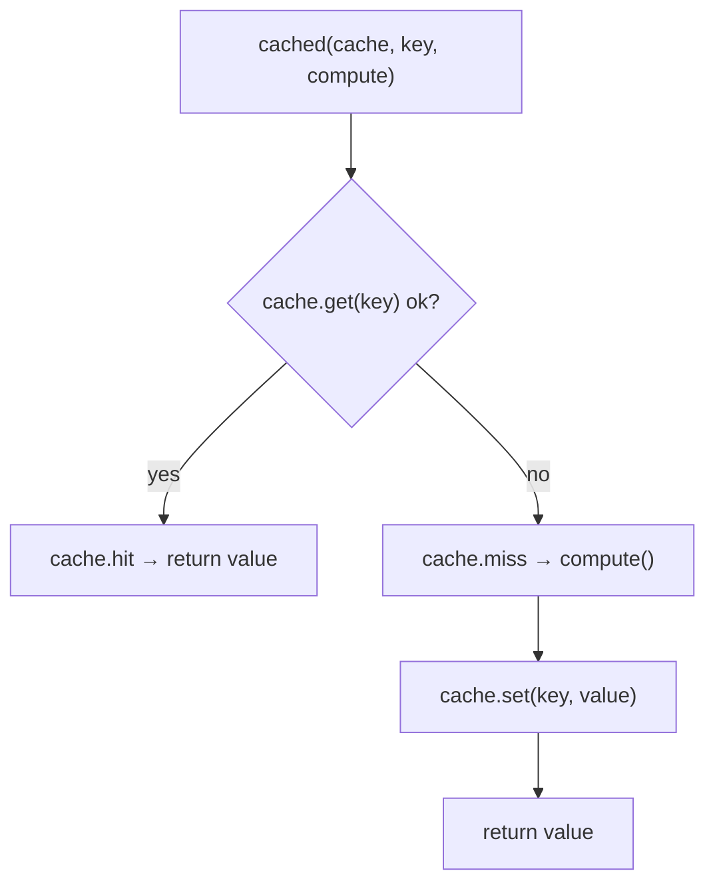

# Cache（成本控制与回归稳定）

## 解决的问题

在 Agent 系统里，你会反复“做同一件贵事”：

- loop 里重复调用同一个工具
- debug 时一遍遍跑同一段 prompt
- 回归时重复跑 eval suite

缓存能帮你：

- 降低成本与延迟
- 让回归更稳定（尤其是 eval）
- 少烧 token（“这一步我刚做过”）

## 它是如何运作的（本仓库实现）

本仓库的缓存非常朴素，但够用：

- `InMemoryCache[T]`：`key -> CacheEntry(value, expires_at?)`
- `cached(...)`：典型的 get-or-compute 封装（可选 `ttl_s`）
- 如果传了 `Tracer`，会打事件：`cache.hit / cache.miss / cache.set`



## 什么时候用 / 什么时候别用

适合用在**幂等**、可复用的操作上：

- 确定性的工具（解析器、纯函数、静态语料检索）
- 上游不稳定但“重试很贵”的调用
- 回归评测（稳定比新鲜更重要）

不建议用在：

- 有副作用的动作（发邮件、扣费、写文件）
- 强时效问题（价格/新闻/“今天的…”）除非 TTL 很短
- 过期结果比慢更糟的场景

## 一个能对照的例子

```python
from agent_patterns_lab.runtime import InMemoryCache, Tracer, cached

cache = InMemoryCache[str]()
tracer = Tracer()

def expensive() -> str:
    return "hello"

v1 = cached(cache, key="k:demo", compute=expensive, ttl_s=60, tracer=tracer)  # miss + set
v2 = cached(cache, key="k:demo", compute=expensive, ttl_s=60, tracer=tracer)  # hit

assert v1 == v2 == "hello"
tracer.export_jsonl(".traces/cache-demo.jsonl")
```

## 常见失败模式与对策

- **key 冲突**：key 里要包含真实输入（tool 名 + args hash、prompt hash 等）。
- **结果过期**：用 `ttl_s`；或者把“版本号/时间戳”写进 key。
- **内存膨胀**：需要淘汰策略（LRU）或定期清理（本仓库没实现）。
- **缓存了错误输出**（幻觉/工具错误）：只缓存“通过校验”的结果，或把状态纳入 key。

## 本仓库对应代码

- 实现： [`src/agent_patterns_lab/runtime/cache.py`](https://github.com/lifeodyssey/agent-patterns-lab/blob/main/src/agent_patterns_lab/runtime/cache.py)
- 测试： [`tests/test_cache.py`](https://github.com/lifeodyssey/agent-patterns-lab/blob/main/tests/test_cache.py)
