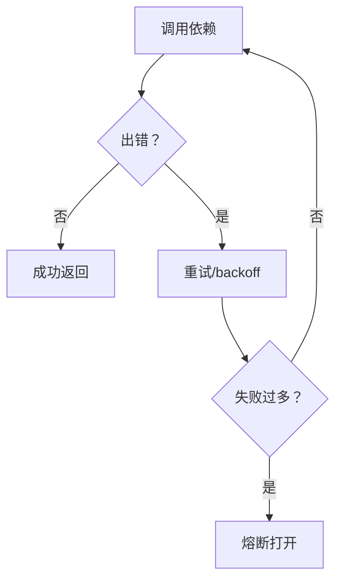

# 可靠性基建（重试/降级/熔断）

## 解决的问题

真实系统一定会失败：

- 瞬时错误（超时、限流）
- 工具不稳定
- 上游宕机

可靠性基建是“横切能力”，不属于某一个模式，但能显著提升整体可用性。

## 三件套

- **Retry**：失败重试 + backoff。
- **Fallback chain**：尝试替代策略/替代提供方。
- **Circuit breaker**：失败过多时短暂断路，避免雪崩。

## 本仓库对应代码

- 实现：`src/agent_patterns_lab/runtime/reliability.py`
- 测试：`tests/test_reliability.py`
