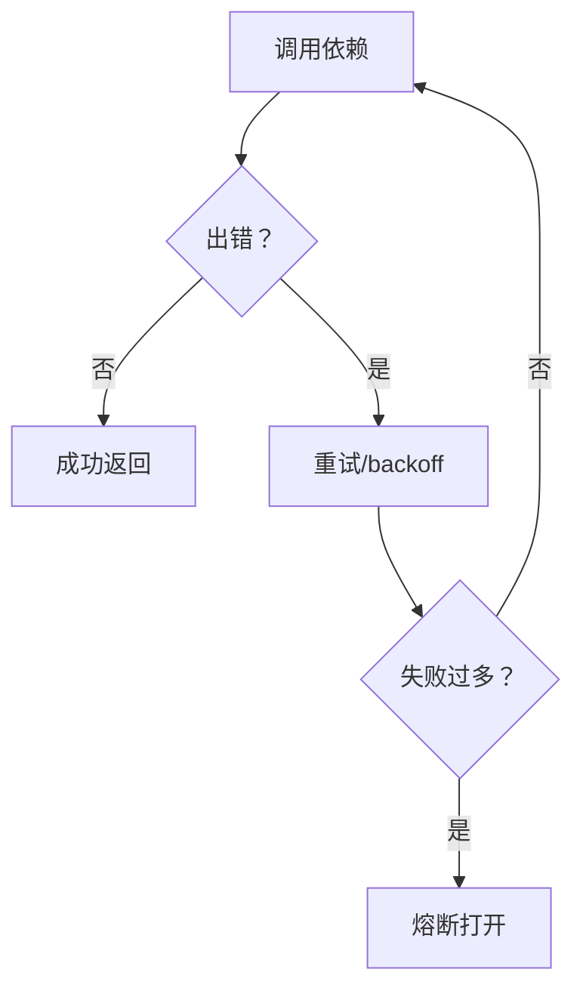

# 可靠性基建（重试/降级/熔断）

## 解决的问题

真实系统一定会失败：

- 瞬时错误（超时、限流）
- 工具不稳定
- 上游宕机

可靠性基建是“横切能力”，不属于某一个模式，但能显著提升整体可用性。

## 它是如何运作的（本仓库实现）

本仓库实现了三件套（都很小，但够用）：

- `retry(fn, attempts, backoff_s, ...)`
- `fallback_chain([fn1, fn2, ...])`
- `CircuitBreaker.call(fn)`

重点不在“花活”，而在于：你总得有一个统一的地方处理失败、做 trace、做止损。

## 三件套

- **Retry**：失败重试 + backoff。
- **Fallback chain**：尝试替代策略/替代提供方。
- **Circuit breaker**：失败过多时短暂断路，避免雪崩。



## 什么时候用 / 什么时候别用

适合用在：

- 有网络/上游依赖（LLM API、远程工具）
- 工具不稳定但“重试安全”的场景
- 线上流程不能随便崩的场景

别盲目重试：

- 有副作用的动作（扣费、发邮件、写入）除非你有幂等 key / 去重机制
- 永久性错误（参数错、鉴权错）——重试只会浪费钱和时间

## 一个能对照的例子

```python
from agent_patterns_lab.runtime import CircuitBreaker, Tracer, fallback_chain, retry

tracer = Tracer()

# Retry：第一次失败，第二次成功
calls = {"n": 0}

def flaky() -> str:
    calls["n"] += 1
    if calls["n"] == 1:
        raise RuntimeError("transient")
    return "ok"

assert retry(flaky, attempts=3, backoff_s=0, tracer=tracer) == "ok"

# Fallback：主方案挂了，备用方案顶上
assert fallback_chain([lambda: (_ for _ in ()).throw(RuntimeError("down")), lambda: "ok"], tracer=tracer) == "ok"

# Circuit breaker：连续失败后打开熔断
cb = CircuitBreaker(failure_threshold=2, reset_timeout_s=60)
for _ in range(2):
    try:
        cb.call(lambda: (_ for _ in ()).throw(RuntimeError("boom")), tracer=tracer)
    except RuntimeError:
        pass
```

## 常见失败模式与对策

- **重试风暴**：加 jitter + 预算；遇到限流要更激进 backoff。
- **fallback 把问题“盖住了”**：一定要打事件并统计/告警（否则你以为系统很稳，其实一直在降级）。
- **熔断太敏感**：不同依赖要不同阈值；“LLM API”与“本地工具”不是一个失败分布。

## 本仓库对应代码

- 实现： [`src/agent_patterns_lab/runtime/reliability.py`](https://github.com/lifeodyssey/agent-patterns-lab/blob/main/src/agent_patterns_lab/runtime/reliability.py)
- 测试： [`tests/test_reliability.py`](https://github.com/lifeodyssey/agent-patterns-lab/blob/main/tests/test_reliability.py)
