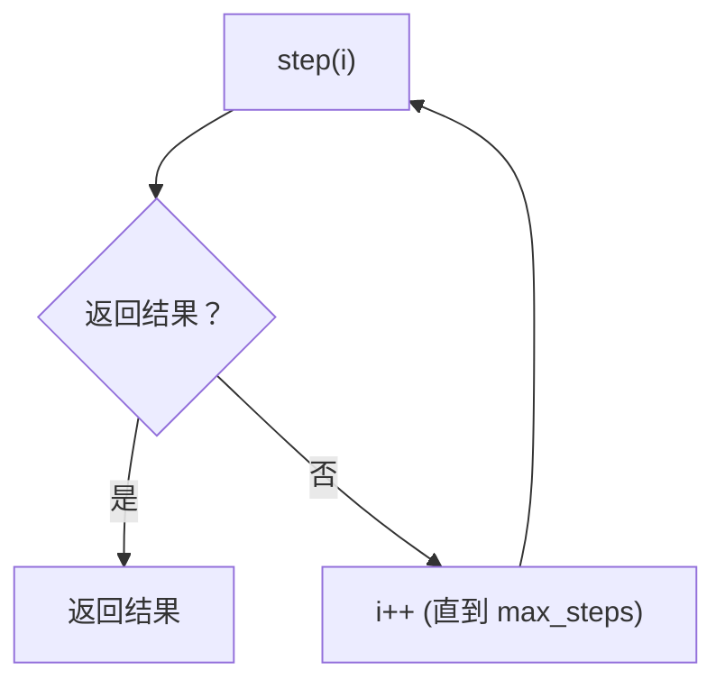

# loop 控制器（预算与确定性终止）

## 解决的问题

Agent loop 可能无限运行。loop 控制器提供：

- `max_steps` 预算
- “有结果就停”的统一协议
- 可追踪的 step/done 事件

## 本仓库对应代码

- 实现： [`src/agent_patterns_lab/runtime/runner.py`](https://github.com/lifeodyssey/agent-patterns-lab/blob/main/src/agent_patterns_lab/runtime/runner.py)
- 测试： [`tests/test_runner.py`](https://github.com/lifeodyssey/agent-patterns-lab/blob/main/tests/test_runner.py)

