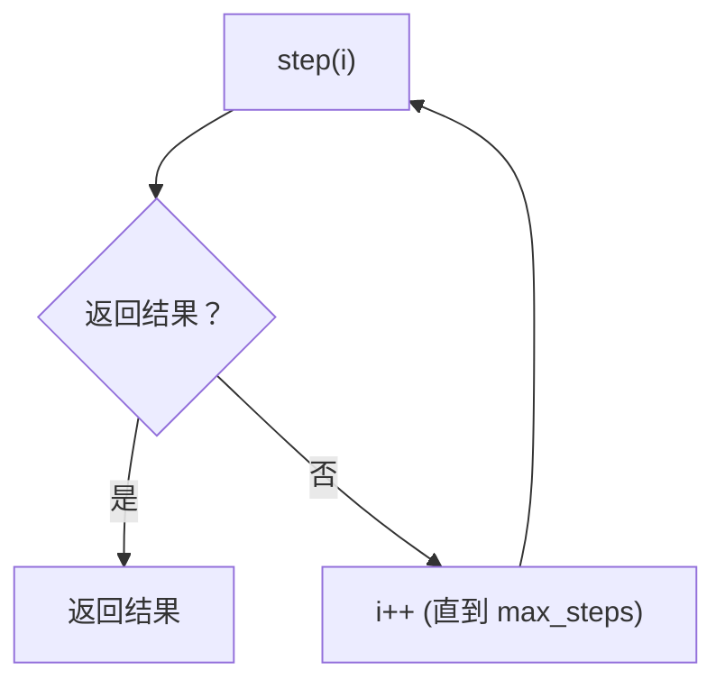

# loop 控制器（预算与确定性终止）

## 解决的问题

Agent loop 可能无限运行。loop 控制器提供：

- `max_steps` 预算
- “有结果就停”的统一协议
- 可追踪的 step/done 事件



## 它是如何运作的（本仓库实现）

核心就是 `run_loop(step_fn, limits=RunLimits(max_steps=...))`：

- `step_fn(i)` 返回 **值** 就结束；返回 `None` 就继续
- 会打 trace：`loop.step`、`loop.done`、`loop.max_steps`
- 超过 `max_steps` 还没结束就抛 `MaxStepsExceeded`

很朴素。但够稳。更高阶的“语义”（停滞检测/重规划/预算）交给各个 pattern 做。

## 什么时候用 / 什么时候别用

只要你的 agent 需要多步，就应该有 loop 控制器：

- ReAct 工具循环
- retrieval loop
- 多轮 review/revise（maker-checker 等）

如果控制流固定（prompt chaining 且步数确定），可以不必引入 loop controller。

## 一个能对照的例子

```python
from agent_patterns_lab.runtime import RunLimits, Tracer, run_loop

tracer = Tracer()

def step(i: int) -> str | None:
    if i < 2:
        return None
    return "done"

out = run_loop(step, limits=RunLimits(max_steps=5), tracer=tracer)
assert out == "done"
```

## 常见失败模式与对策

- **停不下来**：设置 `max_steps`，并把 `MaxStepsExceeded` 当成一种正常 outcome 处理。
- **原地打转**：在 pattern 层加停滞检测（重复动作/重复 query 等）。
- **预算太紧**：不同任务/不同模式要不同预算，别用一个全局默认一刀切。

## 本仓库对应代码

- 实现： [`src/agent_patterns_lab/runtime/runner.py`](https://github.com/lifeodyssey/agent-patterns-lab/blob/main/src/agent_patterns_lab/runtime/runner.py)
- 测试： [`tests/test_runner.py`](https://github.com/lifeodyssey/agent-patterns-lab/blob/main/tests/test_runner.py)
