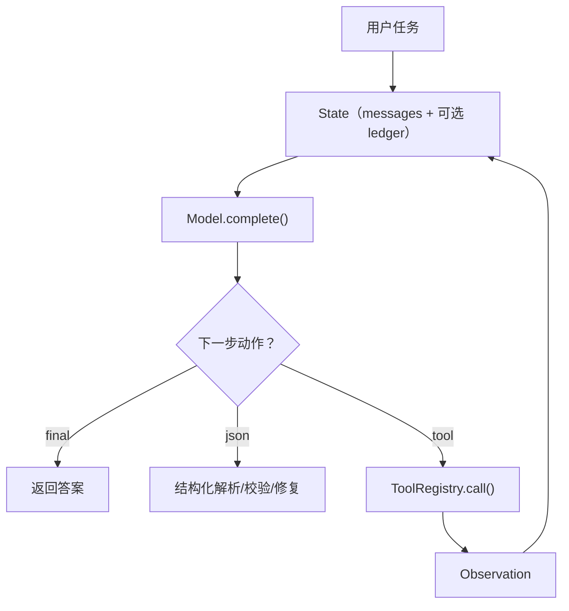

# 运行时总览（可复用的“乐高积木”）

## 解决的问题

如果每个 pattern 都用“临时脚本”写一遍，很快会遇到两件事：

- 模式之间没法公平对比（输入输出不一致、假设不一致）
- 没法做回归（每次跑出来都像雪花，debug 也没抓手）

所以本仓库坚持一个 **最小运行时**：少量、可复用的积木，让模式只是“组合方式不同”。朴素，但能长期维护。

## 运行时包含什么

绝大多数模式，本质都是在复用一组运行时能力：

1. **消息格式**：最小对话结构（`system/user/assistant/tool`）。
2. **模型接口**：统一 `complete(messages) -> str`。
3. **结构化输出**：JSON 提取 + schema 校验 + 修复重试。
4. **工具调用**：注册工具与调用协议（可追踪、可审计）。
5. **loop 控制器**：`max_steps` 预算与确定性终止。
6. **检索**：离线语料索引，支撑 RAG demo/test。
7. **记忆**：KV + session store（离线优先）。
8. **可靠性**：重试/降级/熔断。
9. **治理**：Policy/Guardrails/HITL 审批。
10. **可观测与评测**：Tracing + Eval Harness。

## 它是如何运作的（直觉版）

本质上就是围绕“状态（messages + 可选账本）”的闭环：



一句话：**模式的差异主要在“怎么决定下一步”和“怎么做校验/止损”**。

## 为什么要“最小运行时”

- 让模式 **可组合**、可比较（同一套输入输出约束）
- 让测试 **离线确定性**（MockLLM）
- 保持 **无框架依赖**（不靠 LangChain/LangGraph）

## 什么时候用 / 什么时候别用

**适用：**

- 你要做一组 pattern 的“参考实现”，希望它们共享一套最小积木。
- 你需要离线可跑的 examples/tests（可回归、可复盘）。
- 你希望把“工具调用/预算/治理/追踪”这些横切能力统一起来。

**不适用：**

- 你只是一次性脚本，写完就扔（runtime 的抽象反而是负担）。
- 你已经决定全量使用某个框架生态（那就直接用框架的 runtime 约定即可）。

## 一个能对照的例子

跑一个离线且确定性的例子（不需要网络/API key）：

```bash
uv run python examples/21_react_loop.py
```

再去看 `.traces/` 里的 JSONL，你能清楚看到旅游规划 Agent 每一步发生了什么。命令细节见 [命令解释](../run_commands.md)。

## 常见失败模式与对策

- **所有问题都变成“调 prompt”**：把 runtime API 保持小而清晰（结构化输出很关键）。
- **测试不稳定**：默认用 `MockLLM` + 离线工具；真实模型放到 extras。
- **loop 停不下来**：强制 `max_steps` 预算，并在 trace 里记录终止原因。

## 本仓库对应代码

- Types/messages： [`src/agent_patterns_lab/runtime/types.py`](https://github.com/lifeodyssey/agent-patterns-lab/blob/main/src/agent_patterns_lab/runtime/types.py)
- Model + MockLLM：`src/agent_patterns_lab/runtime/model.py`、`src/agent_patterns_lab/runtime/mock_model.py`
- Structured： [`src/agent_patterns_lab/runtime/structured.py`](https://github.com/lifeodyssey/agent-patterns-lab/blob/main/src/agent_patterns_lab/runtime/structured.py)
- Tools： [`src/agent_patterns_lab/runtime/tools.py`](https://github.com/lifeodyssey/agent-patterns-lab/blob/main/src/agent_patterns_lab/runtime/tools.py)
- Runner： [`src/agent_patterns_lab/runtime/runner.py`](https://github.com/lifeodyssey/agent-patterns-lab/blob/main/src/agent_patterns_lab/runtime/runner.py)
- Tracing： [`src/agent_patterns_lab/runtime/tracing.py`](https://github.com/lifeodyssey/agent-patterns-lab/blob/main/src/agent_patterns_lab/runtime/tracing.py)
- Reliability： [`src/agent_patterns_lab/runtime/reliability.py`](https://github.com/lifeodyssey/agent-patterns-lab/blob/main/src/agent_patterns_lab/runtime/reliability.py)
- Cache： [`src/agent_patterns_lab/runtime/cache.py`](https://github.com/lifeodyssey/agent-patterns-lab/blob/main/src/agent_patterns_lab/runtime/cache.py)
- Memory： [`src/agent_patterns_lab/runtime/memory/`](https://github.com/lifeodyssey/agent-patterns-lab/blob/main/src/agent_patterns_lab/runtime/memory/)
- Governance：`src/agent_patterns_lab/runtime/policy.py`、`src/agent_patterns_lab/runtime/guardrails.py`、`src/agent_patterns_lab/runtime/hitl.py`
- Eval： [`src/agent_patterns_lab/runtime/evals/`](https://github.com/lifeodyssey/agent-patterns-lab/blob/main/src/agent_patterns_lab/runtime/evals/)
