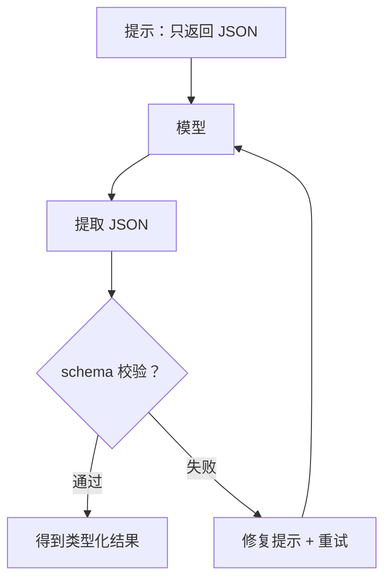

# 结构化输出（JSON + 修复重试）

## 解决的问题

一旦你希望模型输出 **机器可读数据**（路由结果、工具调用、计划列表…），纯文本就会变脆弱：

- JSON 外围夹杂解释文字
- code fence（```json ... ```）
- 缺字段 / 类型错 / 值不合法

**结构化输出**提供了“可测试的纪律层”：把模型输出变成可验证的对象。

## 它是如何运作的（核心流程）

1. 要求输出 JSON。
2. 从返回中提取第一个可解析的 JSON 值。
3. 用小 parser 做 schema 校验。
4. 校验失败则发 **repair prompt** 重试。



## 什么时候用

- 路由决策
- 工具调用 / action schema
- 计划（步骤列表）
- 任何需要离线回归测试的“类 API 输出”

## 一个能对照的例子

第一次返回是“合法 JSON”，但 schema 校验失败；第二次才修好。

```python
from typing import Any

from agent_patterns_lab.runtime import Message, MockLLM, SchemaValidationError, structured_complete

model = MockLLM(['{"answer": 123}', '{"answer": "hello"}'])

messages = [
    Message(role="system", content='只返回 JSON：{"answer": "<string>"}'),
    Message(role="user", content="Say hello."),
]

def parse_answer(value: Any) -> str:
    if not isinstance(value, dict):
        raise SchemaValidationError("expected object")
    answer = value.get("answer")
    if not isinstance(answer, str):
        raise SchemaValidationError('"answer" must be string')
    return answer

out = structured_complete(model, messages, parser=parse_answer, schema_hint='{"answer":"<string>"}')
assert out == "hello"
```

## 常见失败模式与对策

- **一直不肯只输出 JSON**：收紧 system prompt；降温；增加重试次数。
- **schema 变得很大**：拆成 workflow，多步分别校验。
- **repair 把问题“盖住了”**：每次 attempt 都打 trace，并统计 repair 比例。

## 本仓库对应代码

- 实现： [`src/agent_patterns_lab/runtime/structured.py`](https://github.com/lifeodyssey/agent-patterns-lab/blob/main/src/agent_patterns_lab/runtime/structured.py)
- 示例： [`examples/10_structured_output.py`](https://github.com/lifeodyssey/agent-patterns-lab/blob/main/examples/10_structured_output.py)
- 测试： [`tests/test_structured.py`](https://github.com/lifeodyssey/agent-patterns-lab/blob/main/tests/test_structured.py)
