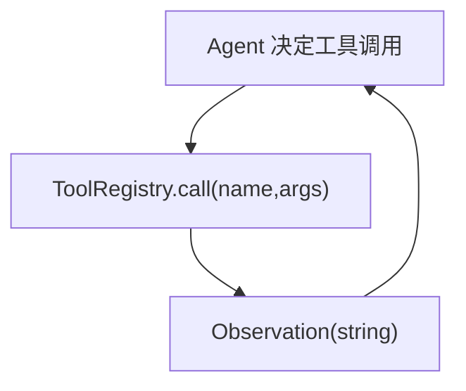

# 工具调用（Registry + Protocol）

## 解决的问题

Agent 必须“行动”：检索、计算、调用 API、读写文件等。Tool calling 把动作变成：

- 显式 `tool_name + args`
- 可追踪、可测试
- 可插入治理点（policy/guardrails/HITL）

## 最小形态

- 注册工具
- `call(name,args)` 执行
- 返回 string observation 写回上下文

## 常见失败点

- 工具不存在
- 工具异常
- 工具输出过大/不安全

因此要配合治理（Policy/Guardrails/HITL）。

## 本仓库对应代码

- 实现： [`src/agent_patterns_lab/runtime/tools.py`](https://github.com/lifeodyssey/agent-patterns-lab/blob/main/src/agent_patterns_lab/runtime/tools.py)
- 示例： [`examples/20_tool_calling.py`](https://github.com/lifeodyssey/agent-patterns-lab/blob/main/examples/20_tool_calling.py)
- 测试： [`tests/test_tools.py`](https://github.com/lifeodyssey/agent-patterns-lab/blob/main/tests/test_tools.py)

