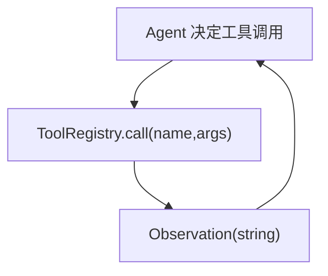

# 工具调用（Registry + Protocol）

## 解决的问题

Agent 必须“行动”：检索、计算、调用 API、读写文件等。Tool calling 把动作变成：

- 显式 `tool_name + args`
- 可追踪、可测试
- 可插入治理点（policy/guardrails/HITL）

## 它是如何运作的（本仓库实现）

本仓库把 tool 做到很薄：

- `Tool(name, description, handler)`：就是一个小包装。
- `ToolRegistry`：按 name 存起来，对外提供 `call(name, args) -> str`。
- tool 的输出当作 **observation**，写回 agent loop。



一句话：tool 是 agent “接触世界”的入口，所以 tracing/policy/guardrails/HITL 最自然就挂在 tool call 上。

## 什么时候用 / 什么时候别用

适合用工具的情况：

- 答案依赖外部信息（检索、API、文件）
- 你需要“动作”，不只是文字（写文件、跑命令、发消息）

不适合硬上工具的情况：

- 纯内部推理就能解决（引入工具只会变慢、变脆）
- tool 输出不可控，但你又没有验证方案

## 一个能对照的例子

```python
from agent_patterns_lab.runtime import Tool, ToolRegistry

def add(args: dict) -> str:
    a = int(args.get("a", 0))
    b = int(args.get("b", 0))
    return str(a + b)

tools = ToolRegistry(
    [
        Tool(name="add", description="Add two integers.", handler=add),
    ]
)

out = tools.call("add", {"a": 2, "b": 3})
assert out == "5"
```

## 常见失败模式与对策

- **工具不存在**：把“工具列表/描述”写进路由或系统提示；工具名校验失败要可解释。
- **工具执行异常**：让异常可见（trace + 结构化错误）；必要时在 loop 层做 retry/backoff。
- **工具输出过大**：截断/摘要/“落盘后引用”（把大文本变成可指针）。
- **工具输出注入**：把 observation 当不可信输入；把“指令”与“证据/观测”隔离。

## 本仓库对应代码

- 实现： [`src/agent_patterns_lab/runtime/tools.py`](https://github.com/lifeodyssey/agent-patterns-lab/blob/main/src/agent_patterns_lab/runtime/tools.py)
- 示例： [`examples/20_tool_calling.py`](https://github.com/lifeodyssey/agent-patterns-lab/blob/main/examples/20_tool_calling.py)
- 测试： [`tests/test_tools.py`](https://github.com/lifeodyssey/agent-patterns-lab/blob/main/tests/test_tools.py)
