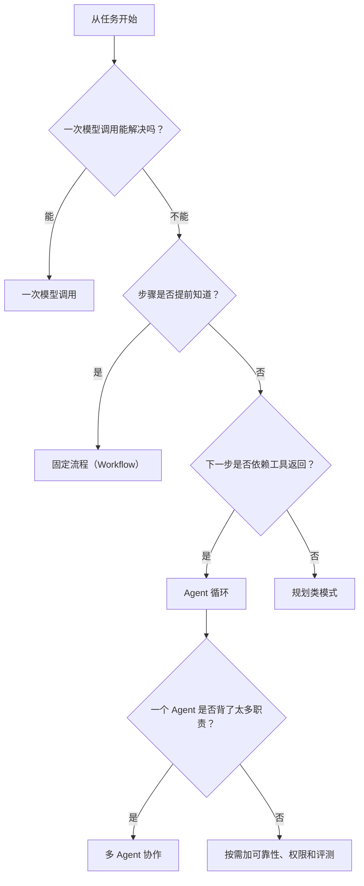

# 选择模式

不要按名字选模式。名字通常越看越像玄学。

更好的办法是问：**我现在遇到的失败是什么？** 下面仍然用旅游规划助手来理解。

## 先问：谁决定下一步？

这张图背后只有三句话：

- **固定流程**：代码决定路径。
- **Agent 循环**：模型决定下一步动作。
- **多 Agent 协作**：多个有专长的控制器一起做事。

## 按症状选

| 你遇到的问题 | 先看这个 | 为什么 |
|---|---|---|
| 输出格式总是坏 | Structured Output | 行程要稳定输出成 JSON/Markdown，方便前端渲染。 |
| 任务步骤固定 | Prompt Chaining | 固定做“问偏好 -> 生成草案 -> 格式化”。 |
| 输入会流向不同任务 | Routing | 用户可能问天气、签证、预算、退款，先分流。 |
| 需要工具，但不知道要调几次 | ReAct | 查天气后才知道要不要改室内路线。 |
| 一次检索经常漏证据 | Retrieval Loop | 查攻略不够，就改 query 再查一次。 |
| 回答必须带引用、可审计 | Agentic RAG | 用证据清单记录“开放时间/门票/政策来自哪里”。 |
| 答案看起来合理但经常错 | Maker-Checker 或 CoVe | 检查路线时间、景点开放、预算是否冲突。 |
| 多次运行结果波动大 | Voting | 生成多个路线候选，再选最稳的一条。 |
| 计划会被新信息推翻 | Planner-Executor-Replanner | 下雨、闭馆、预算变化时显式重规划。 |
| 工具有依赖关系，或可以并行 | LLM Compiler | 天气、酒店位置、景点时间可并行查，再合并。 |
| 可能路线很多，需要试探 | LATS | 在多条路线树上搜索、评分、回传。 |
| 一个 Agent 职责太多 | Manager-Worker | 美食、交通、预算、住宿拆给不同 worker。 |
| 专家 Agent 想像工具一样调用 | Agents-as-Tools | 把“美食专家 Agent”包装成可调用工具。 |
| 任务中途要转给不同专家 | Handoff | 用户从规划改问退款时，转给订单/客服 Agent。 |
| 多个 Agent 需要讨论/互评 | Group Chat | 多个专家讨论路线，selector 控制最终结论。 |
| 长任务容易卡住或丢线索 | Magentic Orchestration | 用任务清单、进度账本、停滞检测控住长规划。 |
| 工具调用有风险 | Policy + Guardrails + HITL | 订票/付款/取消前做权限检查和人工确认。 |
| 不知道改动有没有变好 | Tracing + Eval Harness | 用固定旅行任务集做回归测试。 |

## 推荐阅读顺序

如果你从零开始，按这个顺序读：

1. [从这里开始](start_here.md)
2. [心智模型](mental_model.md)
3. [ReAct](patterns/react.md)
4. [Prompt Chaining](patterns/workflow_chaining.md)
5. [Routing](patterns/routing.md)
6. [Agentic RAG](patterns/agentic_rag.md)
7. [Planner-Executor-Replanner](patterns/planner_executor_replanner.md)
8. [Manager-Worker](patterns/manager_worker.md)

读完这些，再按自己的问题跳转。

## 成本规则

每个模式都是一笔交易。

| 模式家族 | 买到什么 | 付出什么 |
|---|---|---|
| 固定流程 | 可预测、好测试 | 步骤更固定 |
| Agent 循环 | 能根据工具返回调整 | 延迟、成本、循环失败 |
| 可靠性 | 更可信 | 更多模型调用、更严格接口 |
| 检索 | 外部知识和引用 | 来源质量、引用质量 |
| 规划/搜索 | 更长任务跨度 | 预算和状态管理 |
| 多 Agent 协作 | 专业化、并行 | 协作开销、调试难度 |
| 权限/评测 | 可上线、可回归 | 更多日志、规则和测试 |

先从小的开始。只有当你能说清楚“现在到底坏在哪里”，再加下一层。
