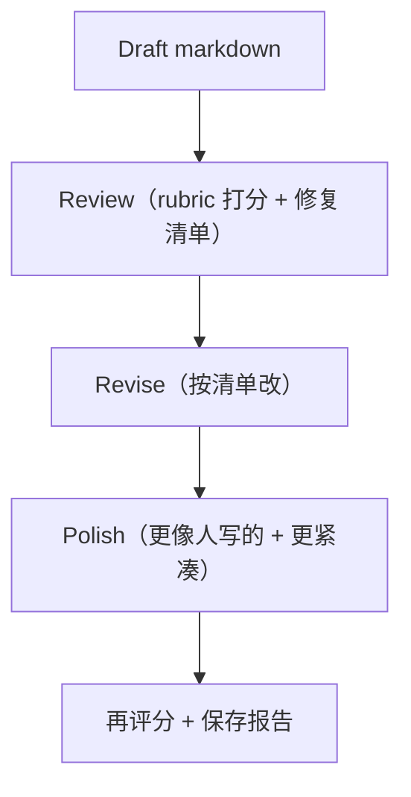

# 写作 Rubric（review → revise → polish）

把写文档当成工程问题：可以 review、可以打分、可以迭代、也可以做回归。

## 解决的问题

文档常见两种“腐烂方式”：

- 技术上没错，但已经不好用（读者看不懂/照着做不了）
- 写得太模板化，读起来像复读机（没人想读，也没人想维护）

这个流水线的目标很直白：把质量变成可见的（分数+建议），把改进变成可重复的（可重跑的 loop）。

## 流程



## 它是如何运作的（本仓库实现）

实现位于 `agent_patterns_lab.runtime.editorial`：

- `Review`：按 rubric 打分 + 给修复清单（结构化 JSON）
- `Revise`：按清单改写（输出新的 markdown）
- `Polish`：把表达变得更像人写的（仍然技术向，减少模板味）

每一步都会再打一次分，方便你看“到底有没有变好”。

## Rubric（0–5）

每个页面按 5 个维度打分（0–5）：

- **清晰度**：概念讲清楚、术语有定义、段落短、读起来不费劲。
- **可操作性**：读者能照着做（步骤/伪代码/输入输出/可复用骨架）。
- **边界**：什么时候用/什么时候不用（失败模式、终止条件、成本/风险）。
- **例子质量**：至少 1 个“能对照”的例子（不只是图）。
- **术语一致性**：同一概念别换叫法；模式名稳定。

分数语义：

- `0`：不可用/误导
- `2`：有帮助但缺核心
- `3`：能用但缺口明显
- `4`：很强，仅小瑕疵
- `5`：可直接发布，表达利落

## “人味”清单（我们优化的方向）

不是让它变油、变随意，而是**更像同事写的**：

- 砍掉“模板连接词堆叠”（那种总结腔/转折腔/官话腔，读者一眼就会跳过）。
- 句子节奏别一模一样；允许几句短句强调重点。
- 少“泛泛而谈”，多“给一个小例子把事说清楚”。
- 别营销腔；该站队就站队（帮助读者做选择）。

## 什么时候用 / 什么时候别用

**适用：**

- 你在写一组会持续迭代的页面（模式库、工程文档、内部手册）。
- 你希望把“好不好读”变成可追踪指标，而不是靠感觉吵架。
- 你在做双语站点，担心两边各写各的、术语漂移。

**不适用：**

- 你只写一次的临时笔记（写完就丢）。
- 你需要的是“事实正确性验证”（那是 CoVe / tests 的问题，不是写作 polish 的问题）。

## 怎么跑（CLI）

离线评分（不改文档）：

```bash
UV_CACHE_DIR=.uv_cache PYTHONPATH=src uv run --no-sync python -m agent_patterns_lab.runtime.editorial \
  --mode offline --input docs --out-dir .editorial
```

真实模型改写（OpenAI / Anthropic）同一条命令，把 `--mode` 换成 `openai|anthropic`，并配置 API key（细节见 `README.md`）。

## 一个能对照的例子

目标：只 review 一页（不改文件），看看评分与修复建议长什么样。

```bash
UV_CACHE_DIR=.uv_cache PYTHONPATH=src uv run --no-sync python -m agent_patterns_lab.runtime.editorial \
  --mode offline \
  --input docs/zh/patterns/react.md \
  --out-dir .editorial
```

你会得到：

- `.editorial/reports/zh/zh/patterns/react.json`：该页面的评分与建议
- `.editorial/REPORT.md`：聚合报告（均分 + 最低分页面）
- `.traces/editorial/editorial.jsonl`：流水线 trace

## 常见失败模式与对策

- **rubric 变成形式主义**：分数只是提醒；最后还是要人读一遍。
- **polish 把含义改掉**：polish 只改节奏与具体性，不“重新发明结论”。
- **双语漂移**：按 locale 分开跑，并维护术语映射（别两边各写各的）。

## 参考（关于“人味/不模板化”的写法）

这些更像“编辑习惯”，不是所谓的花招：

- Microsoft Copilot：How to humanize AI text https://www.microsoft.com/en-us/microsoft-copilot/copilot-101/humanize-ai-text
- How-To Geek：How to avoid sounding like AI https://www.howtogeek.com/how-to-avoid-sounding-like-ai-in-your-writing/
- Adobe：Conciseness in writing（去废话、主动语态）https://www.adobe.com/acrobat/resources/conciseness-in-writing.html
