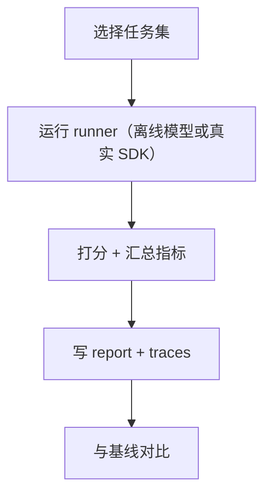

# Eval Harness（Agent 行为回归测试）

## 解决的问题

Agent 是一种 **非确定性程序**：prompt、工具、策略、检索的小改动，都可能让行为悄悄变坏。

Eval harness 的目标是：

- 固定任务集（离线优先）
- 可重复的评分（pass/fail + 指标）
- 产出 trace，方便定位回归原因

## 什么时候用

- 你要上线 Agent，需要“行为 CI”。
- 你在加新模式/新工具/新 guardrail，想要信心。
- 你想对比方案（ReAct vs Plan & Solve）在同一批任务上的差异。

## 什么时候别用

- 你只想“快速看看效果” → 跑一个 example 更快。
- 你的任务强依赖在线外部环境（网页、实时数据）但没有隔离/快照 → 先把可复现性补齐再做回归。

## 核心流程



## 它是如何运作的（本仓库实现）

这个 harness 故意做得很小：

- **任务**就是 Python 函数：默认用 `MockLLM` 跑 patterns（离线确定性）。
- 每个任务产出 `TaskOutcome`（status/score/output/trace_path）。
- 报告同时输出 Markdown + JSON，方便做 baseline diff。

## 一个能对照的例子

离线跑全套（不需要 API key/网络）：

```bash
UV_CACHE_DIR=.uv_cache PYTHONPATH=src uv run --no-sync python -m agent_patterns_lab.runtime.evals --mode offline
```

然后用 baseline 做对比：

```bash
UV_CACHE_DIR=.uv_cache PYTHONPATH=src uv run --no-sync python -m agent_patterns_lab.runtime.evals \
  --mode offline --baseline .evals/results.json
```

## 常见失败模式与对策

- **任务不稳定**：任务尽量离线、确定性；真实模型 eval 另起一套（别混在一起）。
- **分数不贴近真实**：评分要显式（rubric/test/tool），并保留 trace 便于审计。
- **回归悄悄发生**：baseline 固化进 CI 做 diff；别靠“看起来差不多”。

## Repo 对应

- CLI： [`src/agent_patterns_lab/runtime/evals/__main__.py`](https://github.com/lifeodyssey/agent-patterns-lab/blob/main/src/agent_patterns_lab/runtime/evals/__main__.py)
- Tasks： [`src/agent_patterns_lab/runtime/evals/tasks.py`](https://github.com/lifeodyssey/agent-patterns-lab/blob/main/src/agent_patterns_lab/runtime/evals/tasks.py)
- Runner： [`src/agent_patterns_lab/runtime/evals/runner.py`](https://github.com/lifeodyssey/agent-patterns-lab/blob/main/src/agent_patterns_lab/runtime/evals/runner.py)
- Report： [`src/agent_patterns_lab/runtime/evals/report.py`](https://github.com/lifeodyssey/agent-patterns-lab/blob/main/src/agent_patterns_lab/runtime/evals/report.py)
- 测试： [`tests/test_evals_runner.py`](https://github.com/lifeodyssey/agent-patterns-lab/blob/main/tests/test_evals_runner.py)
