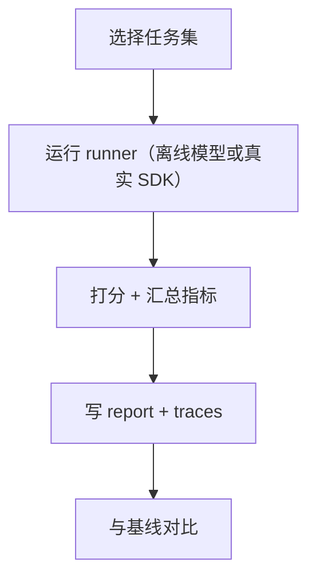

# Eval Harness（Agent 行为回归测试）

## 它解决什么问题

Agent 是一种 **非确定性程序**：prompt、工具、策略、检索的小改动，都可能让行为悄悄变坏。

Eval harness 的目标是：

- 固定任务集（离线优先）
- 可重复的评分（pass/fail + 指标）
- 产出 trace，方便定位回归原因

## 什么时候用

- 你要上线 Agent，需要“行为 CI”。
- 你在加新模式/新工具/新 guardrail，想要信心。
- 你想对比方案（ReAct vs Plan & Solve）在同一批任务上的差异。

## 核心流程

## Repo 对应

- CLI：`src/agent_patterns_lab/runtime/evals/__main__.py`
- Tasks：`src/agent_patterns_lab/runtime/evals/tasks.py`
- Runner：`src/agent_patterns_lab/runtime/evals/runner.py`
- Report：`src/agent_patterns_lab/runtime/evals/report.py`
- 测试：`tests/test_evals_runner.py`

