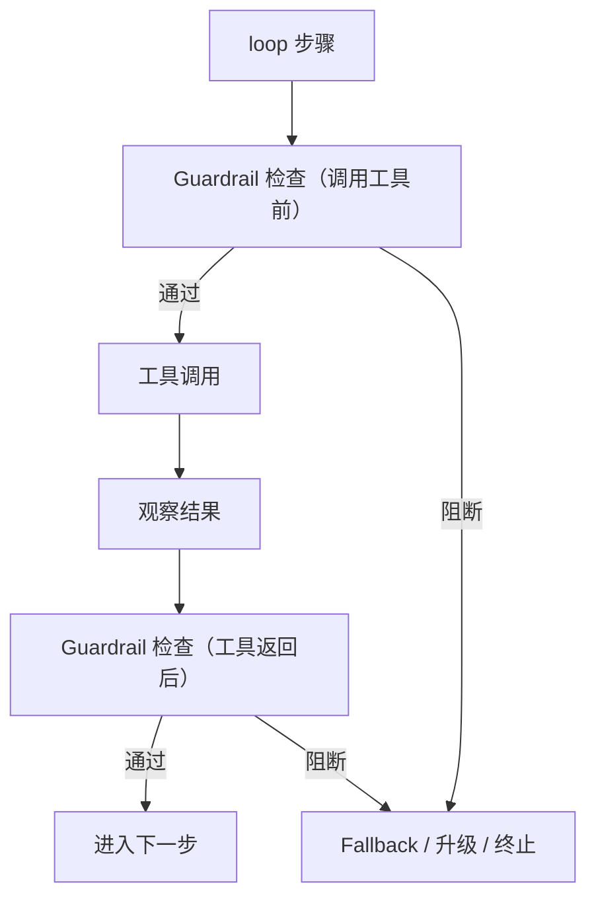

# Guardrails（Tripwire / 运行时校验）

## 解决的问题

Policy 回答“**允不允许这个工具调用**”；Guardrails 回答“**系统此刻是否在安全/正确地运行**”。

Guardrails 是一组可组合的小检查，常见用途：

- 校验工具参数（schema/规则）。
- 检测 prompt injection / 越权指令。
- 强制“不满足证据就不能下结论”等约束。
- 发现异常后触发：阻断 / 降级 / 升级（HITL）/ 终止。

## 什么时候用

- 检索源不可信或可能被注入。
- 需要强制不变量（不出网、不泄露 secrets、只允许特定域名等）。
- 希望在 allowlist 之外再加一层“运行时防线”。

## 它是如何运作的（本仓库实现）

Guardrails 更像“围栏”，挂在几个边界点上：

- **调用工具前**：检查 tool name/args（很多时候和 policy 配合）
- **工具返回后**：检查 observation（长度、禁词、schema 等）
- **最终输出前**：检查输出格式/敏感信息/证据要求

本仓库提供了一些最小 tripwire（例如 `BannedRegexTripwire`、`MaxChars`），并用 `Guardrails` 统一编排。

## 核心流程



## 一个能对照的例子

禁止工具输出包含 `ERROR`：

```python
from agent_patterns_lab.runtime import BannedRegexTripwire, Guardrails

guardrails = Guardrails(tool_output_text=[BannedRegexTripwire(patterns=[r"ERROR"])])
guardrails.check_tool_output("OK")      # pass
guardrails.check_tool_output("ERROR!")  # raises TripwireTriggered
```

## 常见失败模式与对策

- **误伤太多**：调规则、加 allowlist，让阻断理由可解释。
- **Guardrails 变成“Policy 2.0”**：职责要清晰（policy 控能力；guardrails 控运行时行为）。
- **容易被绕过**：把 guardrails 放在 runner/编排层统一执行，而不是散落在某几个 pattern 里。

## 演化路径

- 依赖：**Policy + loop 控制器 + Tracing**
- 常与以下结合：
  - **HITL**（Guardrail 触发时走审批）
  - **Maker-Checker / CoVe**（把验证当成可靠性 Guardrail）

## Repo 对应

- 代码： [`src/agent_patterns_lab/runtime/guardrails.py`](https://github.com/lifeodyssey/agent-patterns-lab/blob/main/src/agent_patterns_lab/runtime/guardrails.py)
- 示例： [`examples/66_governance_hitl_policy_guardrails.py`](https://github.com/lifeodyssey/agent-patterns-lab/blob/main/examples/66_governance_hitl_policy_guardrails.py)
- 测试： [`tests/test_guardrails.py`](https://github.com/lifeodyssey/agent-patterns-lab/blob/main/tests/test_guardrails.py)
