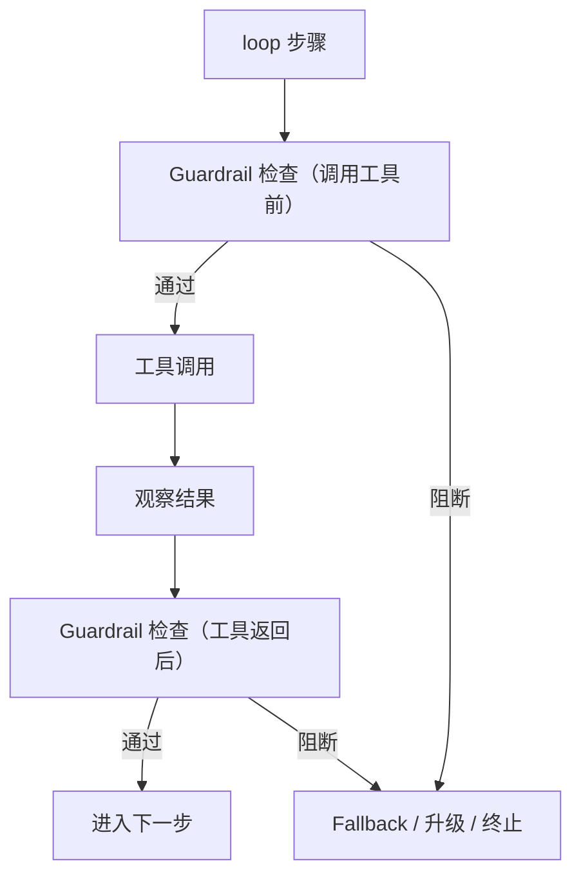

# Guardrails（Tripwire / 运行时校验）

## 它解决什么问题

Policy 回答“**允不允许这个工具调用**”；Guardrails 回答“**系统此刻是否在安全/正确地运行**”。

Guardrails 是一组可组合的小检查，常见用途：

- 校验工具参数（schema/规则）。
- 检测 prompt injection / 越权指令。
- 强制“不满足证据就不能下结论”等约束。
- 发现异常后触发：阻断 / 降级 / 升级（HITL）/ 终止。

## 什么时候用

- 检索源不可信或可能被注入。
- 需要强制不变量（不出网、不泄露 secrets、只允许特定域名等）。
- 希望在 allowlist 之外再加一层“运行时防线”。

## 核心流程

## 演化路径

- 依赖：**Policy + loop 控制器 + Tracing**
- 常与以下结合：
  - **HITL**（Guardrail 触发时走审批）
  - **Maker-Checker / CoVe**（把验证当成可靠性 Guardrail）

## Repo 对应

- 代码：`src/agent_patterns_lab/runtime/guardrails.py`
- 示例：`examples/66_governance_hitl_policy_guardrails.py`
- 测试：`tests/test_guardrails.py`

