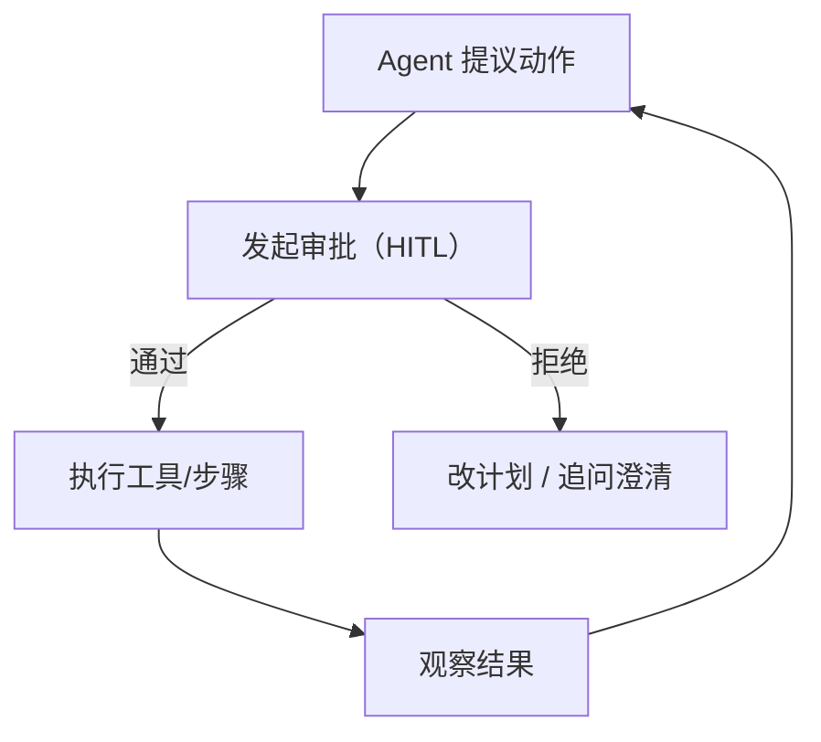

# HITL（Human-in-the-Loop 审批）

## 它解决什么问题

对高风险动作来说，“尽力而为”的自动化不够。HITL 增加一个 **人工审批门**：

- 审批/拒绝某次工具调用（或整个计划）
- 追问关键信息（意图不清、信息缺失）
- 留下可审计的决策记录

## 什么时候用

- 动作不可逆或高风险（付款、删除、发邮件/通知等）。
- 需要强运营控制与问责。
- 想逐步提高自动化程度，同时保持安全边界。

## 核心流程

## 演化路径

- 依赖：**Policy + Guardrails**
- 下一步常见扩展：
  - **多智能体 handoff**（分诊到正确的人/角色/团队）
  - **Eval harness**（审批阈值与风险逻辑的回归测试）

## Repo 对应

- 代码：`src/agent_patterns_lab/runtime/hitl.py`
- 示例：`examples/66_governance_hitl_policy_guardrails.py`
- 测试：`tests/test_hitl.py`

