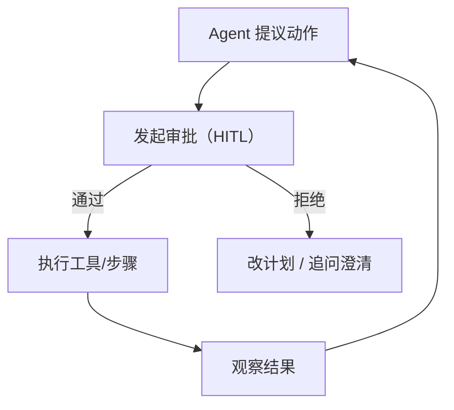

# HITL（Human-in-the-Loop 审批）

## 解决的问题

对高风险动作来说，“尽力而为”的自动化不够。HITL 增加一个 **人工审批门**：

- 审批/拒绝某次工具调用（或整个计划）
- 追问关键信息（意图不清、信息缺失）
- 留下可审计的决策记录

## 什么时候用

- 动作不可逆或高风险（付款、删除、发邮件/通知等）。
- 需要强运营控制与问责。
- 想逐步提高自动化程度，同时保持安全边界。

## 什么时候别用

- 任务是纯读操作且低风险 → 用 policy/guardrails 就够，不必每次拉人。
- 你没法恢复执行（批完也续跑不了）→ 先把“中断/恢复协议”补齐再谈 HITL。

## 它是如何运作的（本仓库实现）

这里的 HITL 走“中断/恢复”协议：

1. 执行高风险动作前先 `hitl.check(tool, args)`。
2. 如果需要审批，会抛 `NeedsApproval(request)`。
3. 把 `request` 呈现给人（或离线用 `ScriptedApprover` 模拟）。
4. 人决定后调用 `hitl.approve(request)` / `hitl.deny(request)`，再重试同一步。

`ApprovalRequest.id` 对同一个 `(tool, args)` 是稳定的，所以“批一次就能续跑”。

## 核心流程



## 一个能对照的例子

```python
from agent_patterns_lab.runtime import HITLController, NeedsApproval

hitl = HITLController(require_approval_for_tools={"deploy"})

try:
    hitl.check("deploy", {"env": "prod"}, reason="prod_requires_approval")
except NeedsApproval as e:
    # 把 e.request 给人看，然后批/拒
    hitl.approve(e.request)

# 审批后重试同一个动作
hitl.check("deploy", {"env": "prod"}, reason="prod_requires_approval")  # now passes
```

## 常见失败模式与对策

- **审批风暴**：审批粒度要对（按 tool+args hash 缓存），别每一步都问人。
- **找错人**：配合 handoff/triage（按工具/风险路由到正确角色）。
- **“反正都会批”**：把 request 写清楚（原因、影响范围、diff），并记录决策日志。

## 演化路径

- 依赖：**Policy + Guardrails**
- 下一步常见扩展：
  - **多智能体 handoff**（分诊到正确的人/角色/团队）
  - **Eval harness**（审批阈值与风险逻辑的回归测试）

## Repo 对应

- 代码： [`src/agent_patterns_lab/runtime/hitl.py`](https://github.com/lifeodyssey/agent-patterns-lab/blob/main/src/agent_patterns_lab/runtime/hitl.py)
- 示例： [`examples/66_governance_hitl_policy_guardrails.py`](https://github.com/lifeodyssey/agent-patterns-lab/blob/main/examples/66_governance_hitl_policy_guardrails.py)
- 测试： [`tests/test_hitl.py`](https://github.com/lifeodyssey/agent-patterns-lab/blob/main/tests/test_hitl.py)
