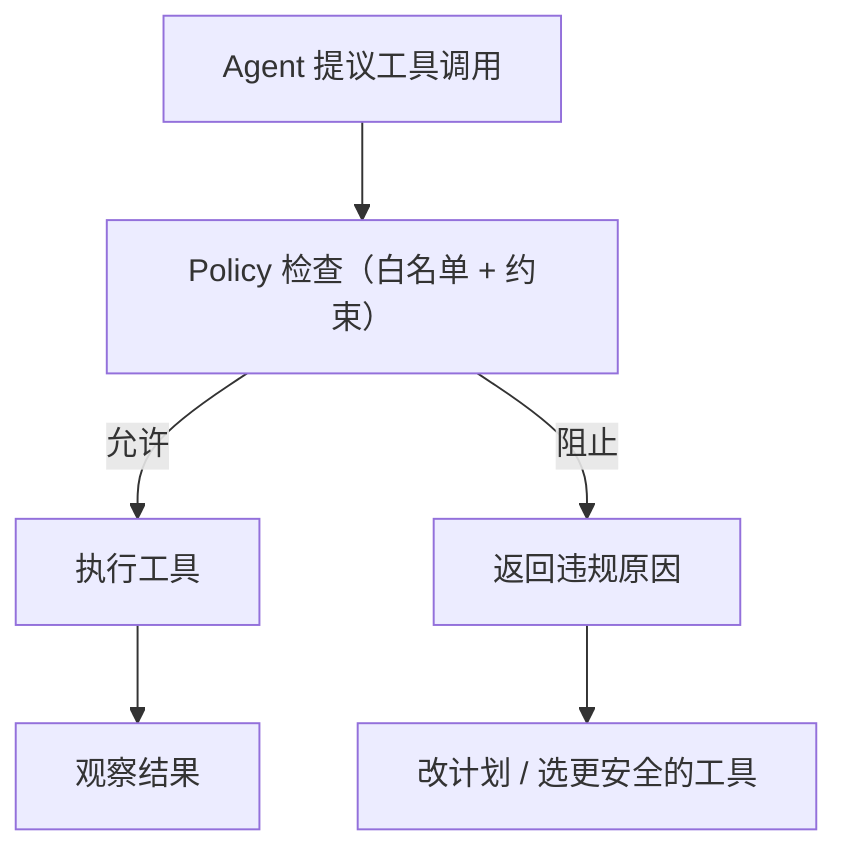

# Policy（能力边界 / 工具策略）

## 它解决什么问题

一旦 Agent 能调用工具，就必须先定义 **能力边界**：

- 防止越权与危险行为（删文件、外发数据等）。
- 控制成本（限流、预算）。
- 让“能做什么/不能做什么”可审计、可复现。

实际工程里，Policy 往往就是：**工具白名单/黑名单 + 约束规则**，对每一次 tool call 生效。

## 什么时候用

- 计划把 Agent 上线，并允许它做真实动作。
- 工具多、风险级别不一。
- 希望在各种模式（ReAct、Agentic RAG、多智能体）里统一控制权限。

## 核心流程

## 演化路径

- 依赖：**工具调用 + 结构化输出 + loop 控制器**
- 常见下一步：
  - **Guardrails**（运行时 Tripwire/校验器）
  - **HITL**（高风险动作走审批）
  - **Evaluation**（避免策略变更导致回归）

## Repo 对应

- 代码： [`src/agent_patterns_lab/runtime/policy.py`](https://github.com/lifeodyssey/agent-patterns-lab/blob/main/src/agent_patterns_lab/runtime/policy.py)
- 示例： [`examples/66_governance_hitl_policy_guardrails.py`](https://github.com/lifeodyssey/agent-patterns-lab/blob/main/examples/66_governance_hitl_policy_guardrails.py)
- 测试： [`tests/test_policy.py`](https://github.com/lifeodyssey/agent-patterns-lab/blob/main/tests/test_policy.py)

