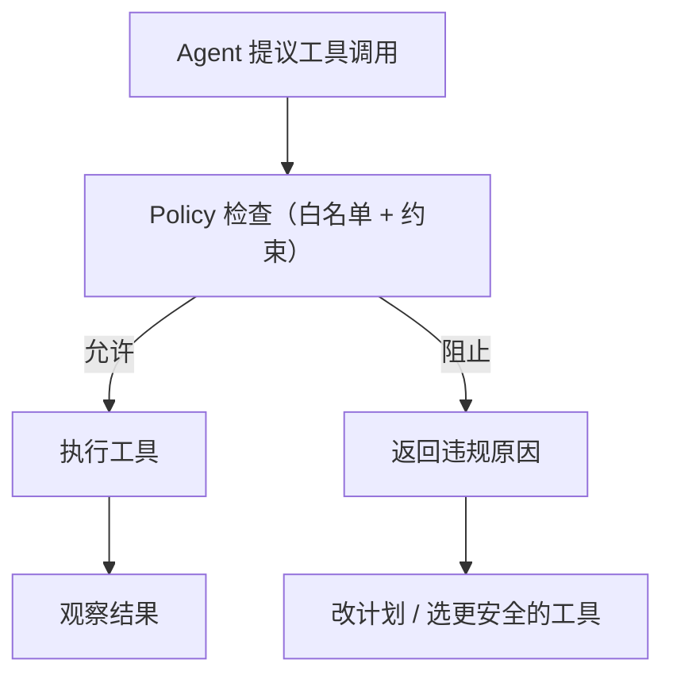

# Policy（能力边界 / 工具策略）

## 解决的问题

一旦 Agent 能调用工具，就必须先定义 **能力边界**：

- 防止越权与危险行为（删文件、外发数据等）。
- 控制成本（限流、预算）。
- 让“能做什么/不能做什么”可审计、可复现。

实际工程里，Policy 往往就是：**工具白名单/黑名单 + 约束规则**，对每一次 tool call 生效。

## 什么时候用

- 计划把 Agent 上线，并允许它做真实动作。
- 工具多、风险级别不一。
- 希望在各种模式（ReAct、Agentic RAG、多智能体）里统一控制权限。

## 它是如何运作的（本仓库实现）

本仓库的 policy 很克制：

- `ToolPolicy`：工具白名单/黑名单 + 可选的 per-tool 参数规则
- `ToolArgsPolicy`：必填字段、允许字段、每个参数的 bounds
- `ParamBound`：最小的约束集合（min/max、长度、regex、allowed values）

典型用法是：在真正执行工具前，跑一次 `policy.check_tool_call(tool_name, tool_args)`。

## 核心流程



## 一个能对照的例子

只允许 `deploy(env=dev|staging|prod)`：

```python
from agent_patterns_lab.runtime import ParamBound, ToolArgsPolicy, ToolPolicy

policy = ToolPolicy(
    allowed_tools={"deploy"},
    per_tool={
        "deploy": ToolArgsPolicy(
            required_keys={"env"},
            bounds={"env": ParamBound(pattern=r"(dev|staging|prod)")},
        )
    },
)

policy.check_tool_call("deploy", {"env": "prod"})  # ok
```

## 常见失败模式与对策

- **策略膨胀**：把 policy 当代码管（review、测试、版本化）。
- **拦得太死**：记录 violation 并迭代；低风险场景用“安全降级”替代硬失败。
- **放得太松**：从白名单起步，逐步放开；别一上来就是 `*`。

## 演化路径

- 依赖：**工具调用 + 结构化输出 + loop 控制器**
- 常见下一步：
  - **Guardrails**（运行时 Tripwire/校验器）
  - **HITL**（高风险动作走审批）
  - **Evaluation**（避免策略变更导致回归）

## Repo 对应

- 代码： [`src/agent_patterns_lab/runtime/policy.py`](https://github.com/lifeodyssey/agent-patterns-lab/blob/main/src/agent_patterns_lab/runtime/policy.py)
- 示例： [`examples/66_governance_hitl_policy_guardrails.py`](https://github.com/lifeodyssey/agent-patterns-lab/blob/main/examples/66_governance_hitl_policy_guardrails.py)
- 测试： [`tests/test_policy.py`](https://github.com/lifeodyssey/agent-patterns-lab/blob/main/tests/test_policy.py)
